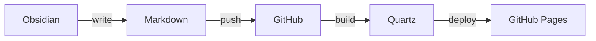
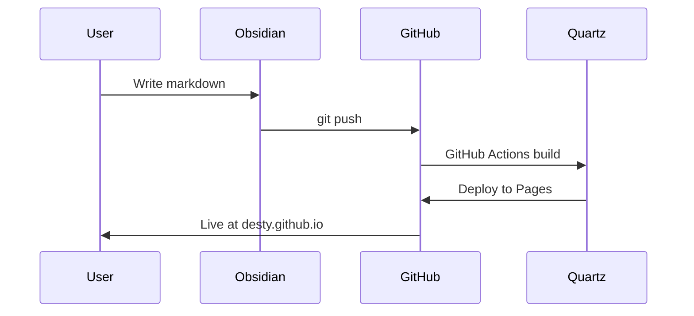

# Hello World

첫 번째 포스트입니다. Obsidian에서 작성한 문서가 그대로 보이는지 테스트합니다.

## Code Block

```typescript
const greet = (name: string): string => {
  return `Hello, ${name}!`
}

console.log(greet("world"))
```

```python
def fibonacci(n: int) -> list[int]:
    fib = [0, 1]
    for i in range(2, n):
        fib.append(fib[i-1] + fib[i-2])
    return fib[:n]

print(fibonacci(10))
```

## Mermaid Diagram





## Callouts

> [!note] 노트
> Obsidian 스타일 callout이 그대로 렌더링됩니다.

> [!warning] 주의
> 이건 경고 callout입니다.

> [!tip] 팁
> 유용한 팁을 여기에 작성할 수 있습니다.

## Internal Links

- [[about|About 페이지]]로 이동
- [[posts/index|Posts 목록]]으로 돌아가기

## Table

| Feature | Supported |
|---------|-----------|
| Wikilinks | `[[link]]` |
| Mermaid | flowchart, sequence |
| Code Highlight | multi-language |
| Callouts | note, warning, tip |
| LaTeX | $E = mc^2$ |
| Tags | #blog #test |
