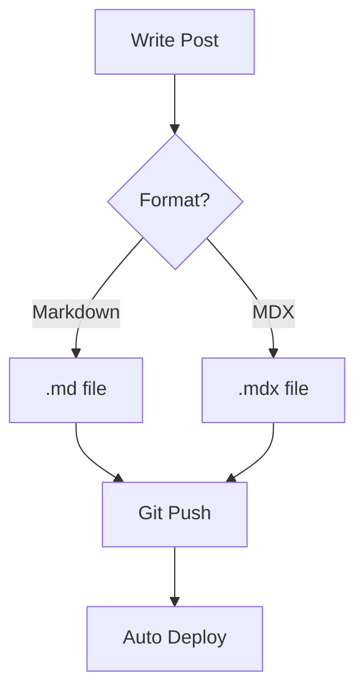
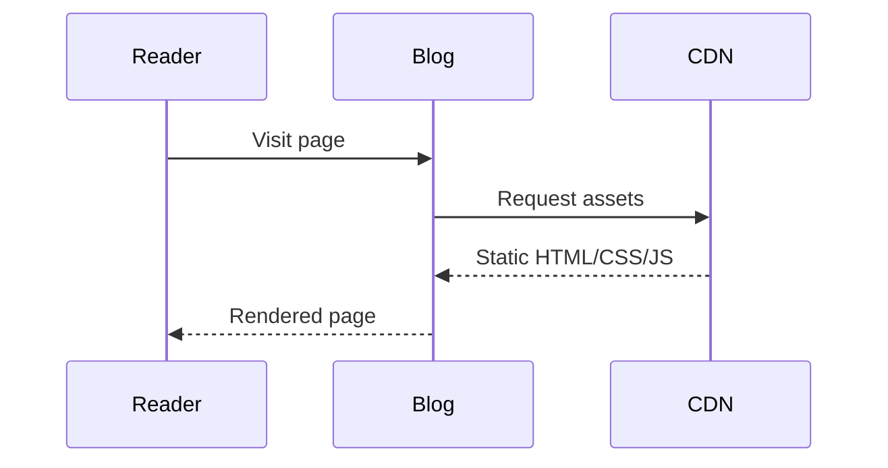

첫 번째 포스트입니다. 이 블로그에서 지원하는 기능들을 테스트합니다.

## Code Block

```typescript
const greet = (name: string): string => {
  return `Hello, ${name}!`
}

console.log(greet("world"))
```

```python
def fibonacci(n: int) -> list[int]:
    fib = [0, 1]
    for i in range(2, n):
        fib.append(fib[i-1] + fib[i-2])
    return fib[:n]

print(fibonacci(10))
```

## Mermaid Diagram





## Table

| Feature | Status |
|---------|--------|
| Code Highlight | multi-language |
| Mermaid | flowchart, sequence |
| Dark Mode | auto toggle |
| Search | full-text |
| MDX | components in markdown |
| LaTeX | $E = mc^2$ |
