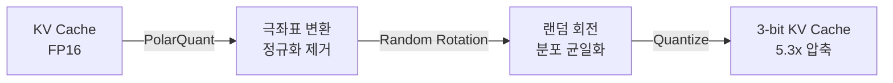

구글이 KV 캐시를 16비트에서 3비트로 줄였다. 메모리 6배 절감, 속도 8배 향상 — 정확도 손실은 0. "압축은 타협이다"라는 상식이 깨진 순간이다.

## KV 캐시가 병목인 이유

LLM 추론에서 가장 비싼 자원은 모델 가중치가 아니다. 컨텍스트가 길어질수록 기하급수적으로 불어나는 **KV 캐시**가 진짜 병목이다. GPT-4급 모델에서 100K 토큰 컨텍스트를 유지하려면 KV 캐시만으로 수십 GB의 GPU 메모리를 점유한다.

기존 양자화 기법(KIVI, KVQuant 등)은 이 문제를 다뤘지만, "압축하면 정확도가 떨어진다"는 트레이드오프를 벗어나지 못했다.

## TurboQuant의 핵심 아이디어

KAIST, NYU, Google DeepMind가 ICLR 2026에서 발표한 [TurboQuant](https://arxiv.org/abs/2504.19874)는 두 가지 핵심으로 구성된다.

**PolarQuant** — 데이터 벡터를 직교좌표에서 극좌표(polar coordinates)로 변환해 정규화 단계를 제거한다.

**랜덤 회전(random rotation)** — 양자화 전에 랜덤 회전을 적용하면 정보 이론적 한계에 근접하는 압축이 가능하다는 발견.

기존 방식은 데이터 분포에 의존하는 복잡한 보정이 필요했다. TurboQuant는 정반대다. **데이터에 대해 아무것도 모르는(data-oblivious) 상태**에서 작동한다. 별도 학습 없이, 런타임 오버헤드도 무시할 수준. 그리고 이 접근이 오히려 더 강력하다는 것을 수학적으로 증명했다.

### 결과

| 지표 | 수치 |
|------|------|
| 압축 후 정확도 | 99.5% 유지 |
| Needle-In-A-Haystack | 104K 토큰까지 풀 정밀도와 동일 |
| H100 어텐션 연산 | 최대 8배 속도 향상 |

## 24시간 만에 벌어진 일들

논문 공개 후 커뮤니티의 반응 속도가 놀라웠다.

- **llama.cpp** — `turbo3`(4.9x 압축), `turbo4`(3.8x 압축) 포맷이 커뮤니티 주도로 구현. Apple Silicon Metal 백엔드까지 동작.
- **RTX 5090** — 70만 토큰 컨텍스트를 4.6x 압축으로 처리하는 벤치마크 등장.
- **$5,000 데스크탑** — 400만 토큰 컨텍스트의 멀티 에이전트 시스템을 로컬 구동. 코드베이스 전체를 컨텍스트에 넣고 여러 에이전트가 요약이나 컨텍스트 삭제 없이 공유하는 구조.

구글이 공식 코드를 공개하기도 전에, Triton, MLX, llama.cpp, CUDA, Vulkan까지 독립 구현이 완료됐다. 여러 팀이 독립적으로 같은 최적화 포인트에 수렴했다는 것은 이 알고리즘이 견고하다는 강력한 신호다.

## 시장 반응과 제본스 패러독스

월스트리트는 TurboQuant를 "메모리 수요 감소 신호"로 해석했다. 하이닉스 -6.2%, 삼성 -4.7%, 합산 시총 약 100조원 증발. Cloudflare CEO는 이를 "구글의 DeepSeek"이라 불렀다.

흥미로운 건 이 논문의 공저자 중 한 명이 KAIST 소속 한인수 연구원이라는 점이다. 한국 연구자가 참여한 기술이 한국 반도체 대장주를 흔든 셈.

하지만 여기서 주목할 건 **제본스 패러독스(Jevons Paradox)**다.

> 효율이 좋아지면 소비가 줄어드는 게 아니라, 접근 가능한 사람이 늘면서 총 수요가 오히려 폭증한다.

같은 GPU로 6배 더 긴 컨텍스트를 처리할 수 있다면? "메모리를 아끼자"가 아니라 "100만 토큰 컨텍스트를 기본으로 쓰자"로 간다. TurboQuant의 진짜 의미는 "더 적은 자원"이 아니라, **같은 자원으로 이전에는 불가능했던 것을 가능하게 만든다**는 데 있다.

로컬 머신에서 에이전트 스웜을, 엣지 디바이스에서 대형 모델을 돌리는 시대가 열리고 있다.

## References

- [TurboQuant — Google Research Blog](https://research.google/blog/turboquant-redefining-ai-efficiency-with-extreme-compression/)
- [TurboQuant — arXiv](https://arxiv.org/abs/2504.19874)
