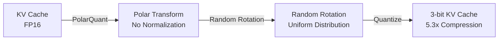

Google reduced the KV cache from 16 bits to 3 bits. 6x memory savings, 8x speed improvement — with zero accuracy loss. The long-held belief that "compression means compromise" just got shattered.

## Why the KV Cache Is the Bottleneck

The most expensive resource in LLM inference isn't the model weights. The real bottleneck is the **KV cache**, which grows exponentially as context length increases. For a GPT-4-class model, maintaining a 100K token context requires tens of gigabytes of GPU memory for the KV cache alone.

Previous quantization techniques (KIVI, KVQuant, etc.) addressed this problem, but none escaped the trade-off of "compress more, lose accuracy."

## The Core Idea Behind TurboQuant

[TurboQuant](https://arxiv.org/abs/2504.19874), presented at ICLR 2026 by researchers from KAIST, NYU, and Google DeepMind, is built on two key innovations.

**PolarQuant** — Converts data vectors from Cartesian to polar coordinates, eliminating the normalization step entirely.

**Random rotation** — Applying random rotation before quantization enables compression that approaches the information-theoretic limit.

Previous methods required complex calibration that depended on data distribution. TurboQuant takes the opposite approach. It operates in a **data-oblivious** state — knowing nothing about the data. No additional training required, with negligible runtime overhead. And the authors mathematically proved that this approach is actually more powerful.

### Results

| Metric | Value |
|------|------|
| Post-compression accuracy | 99.5% retained |
| Needle-In-A-Haystack | Identical to full precision up to 104K tokens |
| H100 attention ops | Up to 8x speedup |

## What Happened in Just 24 Hours

The community's response speed after the paper dropped was remarkable.

- **llama.cpp** — `turbo3` (4.9x compression) and `turbo4` (3.8x compression) formats were implemented by the community. Even runs on Apple Silicon Metal backend.
- **RTX 5090** — Benchmarks appeared showing 700K token context processing with 4.6x compression.
- **$5,000 desktop** — A multi-agent system with 4 million token context running locally. The setup loads an entire codebase into context and lets multiple agents share it without summarization or context pruning.

Before Google even released the official code, independent implementations were already complete across Triton, MLX, llama.cpp, CUDA, and Vulkan. The fact that multiple teams independently converged on the same optimization points is a strong signal that this algorithm is robust.

## Market Reaction and Jevons Paradox

Wall Street interpreted TurboQuant as a "signal of declining memory demand." SK Hynix dropped 6.2%, Samsung fell 4.7%, with a combined market cap loss of roughly $70 billion. Cloudflare's CEO called it "Google's DeepSeek moment."

An interesting side note: one of the paper's co-authors is Insu Han, a researcher affiliated with KAIST. A technology co-developed by a Korean researcher ended up shaking Korea's own semiconductor giants.

But what really deserves attention here is **Jevons Paradox**.

> When efficiency improves, consumption doesn't decrease — instead, more people gain access, and total demand actually surges.

If the same GPU can handle 6x longer contexts, the response won't be "let's save memory" — it'll be "let's make 1 million token contexts the default." The real significance of TurboQuant isn't "fewer resources" — it's **making previously impossible things possible with the same resources**.

We're entering an era where agent swarms run on local machines and large models run on edge devices.

## References

- [TurboQuant — Google Research Blog](https://research.google/blog/turboquant-redefining-ai-efficiency-with-extreme-compression/)
- [TurboQuant — arXiv](https://arxiv.org/abs/2504.19874)
