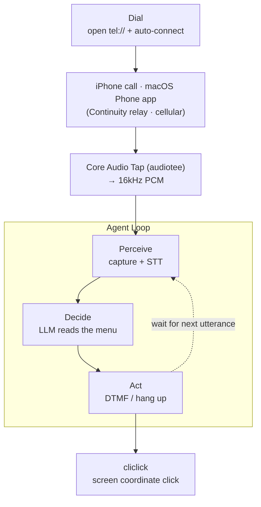

> "[Free opt-out] 080-XXX-XXXX," tacked onto the end of a spam ad text. That one phone call I keep putting off because pressing the buttons is a hassle — could I make my Mac dial it, listen, press the keys, and handle it on its own? Without spending a cent on cloud APIs, on a single M1 MacBook Air.

Bottom line first: it worked. I automated the entire chain — dial → real-time IVR audio capture → Korean transcription → menu decision → DTMF input → hang up — and an actual ad opt-out from a shopping app went through. This post is the technical story that piled up along the way. I'll organize it around the architecture, the STT choice, and the "listen-decide-press" agent loop.

---

## Overall Architecture

A phone agent is, in the end, a **perception → decision → action** loop. Exactly how a person handles an IVR: listen with your ears, understand which menu you're on, press a number.



Break it down block by block and it looks like this.

| Stage | Role | Tech used |
|------|------|-----------|
| Dial | Place the call, press the connect button | `open tel://`, screen capture + button detection + `cliclick` |
| Perceive | Capture call audio + transcribe | **Core Audio process tap** + **mlx-whisper** |
| Decide | Read the IVR menu, decide the next action | LLM (the agent itself) |
| Act | Enter keypad digits, hang up | Coordinate clicks on the call UI |

The key point is that there are **almost no external dependencies**. No telephony API (Twilio/Telnyx), no paid audio driver (Loopback). The phone network is handled by the iPhone linked to the Mac (Continuity), and everything else runs locally on the M1.

---

## 1. STT: Why mlx-whisper / large-v3-turbo

Speech recognition is the eyes and ears of this system. If it's inaccurate here, every decision downstream collapses. I weighed the options.

### whisper.cpp vs MLX

There were two candidates: `whisper.cpp`, ported to C++, and `mlx-whisper`, which runs on the ML framework Apple built for Apple Silicon. On a unified-memory architecture like the M1/M2/M3, MLX makes good use of memory bandwidth and is usually faster. With 16GB of unified memory, even the large family runs with room to spare.

Spin up one isolated environment with `uv` and installation is a single line.

```bash
uv venv --python 3.12 .venv-whisper
uv pip install --python .venv-whisper/bin/python mlx-whisper
```

### What turbo buys you

The real decision was model size. The constraint for call STT is **real-time-ness**. If it can't keep up with the speaking pace, it's useless.

I ran an 8.6-second Korean clip under identical conditions on the M1 MacBook Air.

| Model | Processing time | Real-time factor | Accuracy |
|------|-----------|-------------|--------|
| `large-v3` | 7.1s | ~0.83× (tight) | accurate |
| `large-v3-turbo` | 3.6s | **~0.42× (comfortable)** | accurate, cleaner punctuation too |

`turbo` is a variant that cut decoder layers to push up speed, and the hit to Korean accuracy was negligible. It still handled number and notation normalization — turning a spoken "se si" into "3시" — just the same. A 0.42× real-time factor means a one-minute call is processed in 25 seconds — plenty of headroom for live transcription.

```bash
mlx_whisper input.wav \
  --model mlx-community/whisper-large-v3-turbo \
  --language ko --output-format srt
```

### Small devices that boost accuracy

- **`--initial-prompt`**: Feeding in words that show up often in IVRs ("opt-out, advertisement") as hints raises the recognition rate. It's like tipping off the domain vocabulary in advance.
- **Beware silence hallucinations**: Feed Whisper silence and it spits out training-data echoes like "See you in the next video" or "Thanks for watching." When that shows up, read it not as *the transcription is wrong* but as *the input is silent*. In fact, that hallucination is how I quickly noticed "the audio capture is empty."

---

## 2. Capturing Call Audio: The Hardest Problem in This Project

To transcribe, you first have to get your hands on the call audio. And on macOS, **grabbing call audio** was an unexpected wall.

### First attempt: BlackHole → failed (and why)

At first I went by the textbook. Set BlackHole (a virtual audio driver) as the system output, route the call audio there, and capture it. The result was complete silence. `-91dB`, RMS `0.000000`.

Digging in, this turned out to be not a bug but **by design**. During a call, when a virtual device like BlackHole gets picked up as output, macOS kills the call volume (audio ducking). It blocks call recording for privacy and legal reasons, and BlackHole itself has filed this under "Blame Apple / wontfix." The **intercept-the-output-device** approach is sealed off at the OS level.

### Second attempt: Core Audio process tap → success

The key insight was that "intercepting the output device" and "capturing an app's source" are different mechanisms.

- **Output routing (BlackHole)**: Swap out the whole system output device → the call app detects it and mutes.
- **Process tap (Core Audio tap)**: Leave the output device alone and *passively eavesdrop* only on the audio a specific process emits → it doesn't trip the call app's defenses.

This process-tap API is a first-class feature added in macOS 14.2. It's exactly what the paid app Loopback ($99) sells as "per-app source capture," and there's an open-source tool that does the same thing. [AudioTee](https://github.com/makeusabrew/audiotee) is a Swift CLI that streams system audio as raw PCM to stdout. I built it from source.

```bash
git clone https://github.com/makeusabrew/audiotee.git
cd audiotee && swift build -c release
# 16kHz PCM to stdout — a format that pipes straight into whisper
.build/release/audiotee --sample-rate 16000 > capture.pcm
```

In real tests, both carrier and shopping-app IVR prompts came through cleanly and transcribed as-is. I had **captured cellular call audio, for free, accurately**. There were reports that capture doesn't work in the new Phone app on macOS 26 (Tahoe), but at least in this setup the system tap grabbed it just fine.

> To sum up: **BlackHole (output routing) ❌ → Core Audio process tap (app source capture) ✅.** They may both look like "virtual audio," but the mechanism differs, and whether you get past the OS's defenses is what divides them.

---

## 3. The Agent Loop: Listen → Decide → Press

This is where the "agent" part begins. If capture and STT are the sensory organs, the agent is the brain that takes that input and picks an action.

### Splitting into utterances (VAD)

An IVR doesn't speak in one block. It breaks up like "This is the opt-out service" … (pause) … "Please press 1." So I sliced the capture stream into utterances with energy-based VAD. Every frame (30ms) I measure RMS to judge speech vs. silence, and once silence runs for a set duration I cut it off as one utterance and hand it to STT.

```python
# the core of live_stt.py — energy-based utterance splitting
rms = float(np.sqrt(np.mean(frame * frame)))
if rms >= threshold:            # speech
    buf = np.concatenate([buf, frame]); silence_run = 0.0
else:                            # silence
    silence_run += 0.03
    if in_speech and silence_run >= SILENCE_LIMIT:
        transcribe(buf)          # one utterance complete → transcribe
        buf = empty()
```

The model stays resident in memory via `lru_cache`, eliminating the cost of reloading it per utterance. So from the second utterance on, there's no model load — just pure inference time (in the 3-second range).

### Deciding: reading the IVR menu

The transcribed text is the agent's input context. Korean opt-out IVRs mostly follow a fixed pattern.

1. "To opt out, please press 1" → confirm
2. "Enter your phone number and press the pound key" → number entry
3. "If the number you entered is correct, press 1" → confirm

But one of them was one step smarter. It **auto-recognizes your membership from the caller ID**, so there was no number-entry step at all.

> "Your phone number is 010-XXXX-XXXX. To set up the opt-out, please press 1."

So the decision became simple. **"Press 1."** Interpreting the menu is, in the end, reading natural language and mapping it to an action — exactly what an LLM is best at.

### Acting: how to send DTMF (the longest slog)

"Pressing" the number was the last and trickiest piece. I tried three things.

1. **Keyboard keystroke** (`osascript ... keystroke "1"`) → failed. The call panel doesn't take keyboard focus. The IVR couldn't receive input and dropped the call after a timeout ("please call again").
2. **Accessibility (AX) UI scripting** → failed. The call panel isn't exposed as a standard window. Sweeping the Phone process with `System Events` returned 0 windows. I couldn't grab the keypad buttons via AX.
3. **Coordinate click on the call UI keypad** (`cliclick`) → **success.**

The third was the answer, but there was one more trap. At first it looked like a failure too. I clicked 1 and the IVR went back to its greeting. I suspected the coordinates for a long while — but the coordinates were right from the start. The real cause was **timing**.

> The IVR was mid-playback on a long greeting, and since I only listened-and-transcribed for 7 seconds right after the click, I caught *the tail of the greeting still in progress*. I misread that as "no response." **After waiting 11 seconds post-press,** the IVR responded clearly.

```
"As of June 14, 2026, your opt-out from advertising texts has been completed."
```

There's a general lesson here. **There's a delay between the agent's action and the environment's reaction.** If you read it synchronously — "I pressed it, so there should be a result right away" — you'll be wrong. After acting, leave a sufficient observation window, and only perceive again once the environment has settled. Just like a person listens to the IVR prompt all the way through before pressing the next key.

---

## 4. Dialing and Screen Automation — Small but Essential Glue

Placing the call itself needed automation too.

- **Dialing**: `open "tel://080XXXXXXX"`, one line. iOS dials immediately, but macOS forces Apple's "Click to Call" confirmation alert. There's officially no way around it.
- **Clicking the connect button**: You have to automatically press the green button on that confirmation alert. Its position shifts slightly every time and the alert disappears after a few seconds. So I take a screenshot and **detect the green pixel cluster** to compute the center coordinate and click it.

```python
# find_green.py — unpack PNG to raw RGB, find the green (connect)/red (hang up) button center
mask = (G > 140) & (R < 130) & (B < 130) & (G - R > 50)   # system green
region[:int(H*0.30), int(W*0.62):] = True                  # top-right only
cx, cy = median(xs), median(ys)
print(f"{cx//2},{cy//2}")                                  # retina → logical coords
```

I reused the same detector for the red hang-up button. It's simple computer vision — finding a button by color — but far more robust than hardcoding coordinates.

---

## 5. Aside: Picking Targets Out of 80,000 Texts — Regex Instead of an LLM

The pipeline was done. But **so which number do I actually call?** I opened my received-texts box: 88,161 messages. Out of these I had to sort out the ads and pull the numbers that can be opted out of by phone.

The most naive approach is "throw it all at an LLM and ask whether it's an ad and what the opt-out number is." But 80,000 messages × hundreds of tokens blows **millions of tokens**. Cost aside, it's slow, and the results shift subtly each run, so it's not even reproducible. This is not a place to use an LLM.

### The pattern is guaranteed by law

In Korea, ad texts are legally required under the Network Act to include the **`(광고)` [ad] label** and a **free opt-out method**. In other words, the signal we're looking for is *legally mandated*. This is the domain of regex, and the token count is 0.

```python
# ad detection: the legally-mandated marker
is_ad = "(광고)" in body

# the trap in opt-out number extraction — the body has several numbers
#   main line 1866-xxxx, support line, and the real opt-out 080-xxx-xxxx
#   just grabbing "the first 080" catches the wrong number.
# → prefer numbers near (within 80 chars of) an "opt-out/free-opt-out" keyword
for kw in ["무료수신거부", "수신거부", "무료거부", "거부"]:
    m = re.search(re.escape(kw), body)
    if m:
        near = body[m.end(): m.end()+80]
        pm = PHONE_RE.search(near)   # 080-xxx-xxxx / 080xxxxxxx
        if pm: return normalize(pm.group())
```

### attributedBody can be unpacked sloppily

Recent macOS stores the text body not in a `text` column but in `attributedBody` (a typedstream binary). To parse it properly you'd have to follow NSKeyedArchiver — but **if your goal is classification and number extraction, you don't need to.** Decode the whole blob with `utf-8, errors="ignore"` and the `(광고)` marker and phone numbers survive perfectly fine amid the control-character noise. "Perfect reconstruction" and "extracting the signal you need" are different problems.

### The result

```
88,161 msgs → 7,358 ads → 520 opt-out numbers (59 active)   |   LLM tokens: 0
```

The principle is simple. **An LLM is not a universal hammer.** Knock out 99% with a deterministic filter, and hand only the genuinely ambiguous remainder to the LLM (like the 612 ads that opt out only via URL, with no number). You get cost, speed, and reproducibility all at once. A good agent is set apart by knowing *when not to* use the LLM.

---

## 6. Lessons Salvaged from the Slog

The real meat of a technical write-up is the spots where you got stuck.

- **Leaving iPhone Mirroring on drops the call at 0 seconds.** This was the cause of every dial failing with `ZDURATION=0`. Mirroring appears to occupy the iPhone and conflict with the Continuity call relay. Turning mirroring off connected immediately. — *Judging by the symptom alone (every call fails at 0s) it looks like a code problem, but the real cause was environment state.*
- **Silence is not silent.** Whisper answers silence with hallucinations. Capture validation has to be done by **RMS volume**, not by transcribed text.
- **Doubt whether a "failure" is really a failure.** The DTMF click had been succeeding from the start. The observation timing was just off. When debugging, suspecting *the way I'm measuring* first turned out to be the faster path.
- **Follow the grain of the mechanism.** My biggest mistake was concluding "call capture itself is impossible" just because BlackHole was blocked. Output routing and app source capture were different roads, and the latter was open.

---

## Limits and Next Steps

- **Cellular vs. FaceTime**: This system relays cellular calls through iPhone Continuity. Capture was solved with a process tap, but deeper integration (e.g., the AI becoming a *party* to both sides of the call and speaking) is more natural via FaceTime (VoIP) or a telephony-API route.
- **Two-way speaker-diarized STT**: Right now it captures the other side (the IVR). A two-way call log that also folds in my mic input and diarizes the speakers (them/me) is the next task.
- **Smarter decisions**: For IVRs with more complex menus (branching, re-entry, transfer to an agent), the transcribe → LLM-decide → act loop needs to be wrapped in a more robust state machine.

---

## Closing

There was no grand stack. One M1 MacBook Air, an open-source audio-capture tool, MLX Whisper, and a few little scripts that click the screen. Wire those into a **perceive-decide-act loop** and you get "an AI agent that calls a phone and handles the IVR." No cloud, no monthly subscription, no per-minute billing.

The most valuable outcome isn't the feature itself but the proof of one fact. **Transcribing call audio for free, locally, in real time on a Mac is actually possible.** What you build on top of that is now a matter of imagination.
