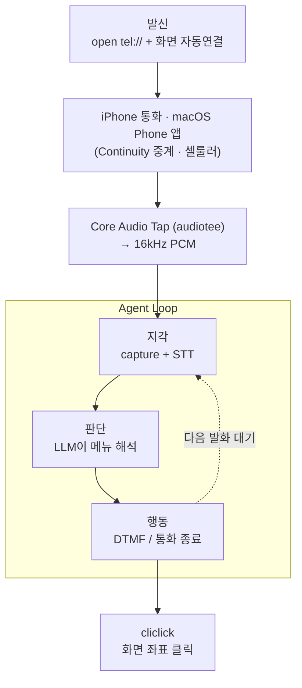

> 스팸 광고 문자 끝에 붙은 "[무료수신거부] 080-XXX-XXXX". 누르기 귀찮아서 미뤄둔 그 한 통의 전화를, 맥이 알아서 걸고·듣고·번호를 눌러 처리하게 만들 수 있을까? 클라우드 API 한 푼 안 쓰고, M1 맥북에어 한 대로.

결론부터 말하면 됐다. 발신 → ARS 음성 실시간 캡처 → 한국어 전사 → 메뉴 판단 → DTMF 입력 → 통화 종료까지 전 과정을 자동화했고, 실제로 한 쇼핑 앱의 광고 수신거부가 처리됐다. 이 글은 그 과정에서 쌓인 기술 이야기다. 아키텍처, STT 선택, 그리고 "듣고-판단하고-누르는" 에이전트 루프를 중심으로 정리한다.

---

## 전체 아키텍처

전화 에이전트는 결국 **지각(perception) → 판단(decision) → 행동(action)** 루프다. 사람이 ARS를 처리하는 방식 그대로다. 귀로 듣고, 무슨 메뉴인지 이해하고, 번호를 누른다.



각 블록을 뜯어보면 이렇게 구성된다.

| 단계 | 역할 | 사용 기술 |
|------|------|-----------|
| 발신 | 전화 걸고 연결 버튼 누르기 | `open tel://`, 화면 캡처 + 버튼 검출 + `cliclick` |
| 지각 | 통화 소리 캡처 + 받아쓰기 | **Core Audio process tap** + **mlx-whisper** |
| 판단 | ARS 메뉴를 읽고 다음 행동 결정 | LLM (에이전트 본체) |
| 행동 | 키패드 번호 입력, 통화 종료 | 통화 UI 좌표 클릭 |

핵심은 **외부 의존성이 거의 없다**는 점이다. 통신 API(Twilio·Telnyx)도, 유료 오디오 드라이버(Loopback)도 안 쓴다. 전화망은 맥에 연동된 아이폰(Continuity)이 대신 처리하고, 나머지는 전부 M1 위에서 로컬로 돈다.

---

## 1. STT: 왜 mlx-whisper / large-v3-turbo 인가

음성 인식은 이 시스템의 눈이자 귀다. 여기가 부정확하면 그 뒤의 판단이 전부 무너진다. 선택지를 따져봤다.

### whisper.cpp vs MLX

후보는 둘이었다. C++로 포팅된 `whisper.cpp`, 그리고 애플이 Apple Silicon용으로 만든 ML 프레임워크 위에서 도는 `mlx-whisper`. M1·M2·M3 같은 통합 메모리(unified memory) 구조에서는 MLX 쪽이 메모리 대역폭을 잘 활용해서 보통 더 빠르다. 16GB 통합 메모리면 large 계열도 여유 있게 돌아간다.

`uv`로 격리 환경만 하나 만들면 설치는 한 줄이다.

```bash
uv venv --python 3.12 .venv-whisper
uv pip install --python .venv-whisper/bin/python mlx-whisper
```

### turbo의 의미

진짜 결정은 모델 크기였다. 통화 STT의 제약은 **실시간성**이다. 말하는 속도를 못 따라가면 쓸모가 없다.

M1 맥북에어에서 8.6초짜리 한국어 음성을 같은 조건으로 돌려봤다.

| 모델 | 처리 시간 | 실시간 배율 | 정확도 |
|------|-----------|-------------|--------|
| `large-v3` | 7.1초 | ~0.83배 (빠듯) | 정확 |
| `large-v3-turbo` | 3.6초 | **~0.42배 (여유)** | 정확, 구두점까지 더 깔끔 |

`turbo`는 디코더 레이어를 줄여 속도를 끌어올린 변종인데, 한국어 정확도 손해가 거의 없었다. "세 시"를 "3시"로 바꾸는 식의 숫자·표기 정규화까지 그대로였다. 실시간의 0.42배라는 건 1분 통화를 25초에 처리한다는 뜻이고, 실시간 받아쓰기에 충분한 여유다.

```bash
mlx_whisper input.wav \
  --model mlx-community/whisper-large-v3-turbo \
  --language ko --output-format srt
```

### 정확도를 끌어올리는 작은 장치들

- **`--initial-prompt`**: ARS에 자주 나오는 단어("수신거부, 광고")를 힌트로 넣으면 인식률이 올라간다. 도메인 어휘를 미리 귀띔하는 셈이다.
- **무음 환각 주의**: Whisper에 무음을 먹이면 "다음 영상에서 만나요", "시청해주셔서 감사합니다" 같은 학습 데이터 잔향을 토해낸다. 이게 나오면 *전사가 틀렸다*가 아니라 *입력이 무음이다*라는 신호로 읽어야 한다. 실제로 이 환각 덕분에 "오디오 캡처가 비어 있다"는 걸 빨리 알아챘다.

---

## 2. 통화 오디오 캡처: 이 프로젝트에서 가장 어려웠던 문제

받아쓰기를 하려면 통화 소리부터 손에 쥐어야 한다. 그런데 macOS에서 **통화 오디오를 잡는 일**이 의외의 벽이었다.

### 1차 시도: BlackHole → 실패 (그리고 그 이유)

처음엔 교과서대로 갔다. BlackHole(가상 오디오 드라이버)을 시스템 출력으로 잡고, 통화 소리를 거기로 흘려 캡처하는 방식. 결과는 완전한 무음. `-91dB`, RMS `0.000000`.

찾아보니 이건 버그가 아니라 **설계**였다. macOS는 통화 중에 BlackHole 같은 가상 장치가 출력으로 잡히면 통화 음량을 죽여버린다(audio ducking). 개인정보·법적 이유로 통화 녹음을 막는 것이고, BlackHole 쪽도 이걸 "Blame Apple / wontfix"로 분류해 두었다. **출력 장치를 가로채는** 접근은 OS 레벨에서 봉쇄돼 있었다.

### 2차 시도: Core Audio process tap → 성공

핵심 통찰은 "출력 장치 가로채기"와 "앱 소스 캡처"가 다른 메커니즘이라는 점이었다.

- **출력 라우팅(BlackHole)**: 시스템 출력 장치를 통째로 바꾼다 → 통화 앱이 감지하고 음소거.
- **프로세스 탭(Core Audio tap)**: 출력 장치는 그대로 둔 채, 특정 프로세스가 내보내는 오디오만 *수동으로 엿듣는다* → 통화 앱의 방어에 안 걸린다.

이 프로세스 탭 API는 macOS 14.2부터 들어온 정식 기능이다. 유료 앱 Loopback($99)이 "앱별 소스 캡처"로 파는 기능의 정체가 바로 이거고, 오픈소스로 같은 일을 하는 도구가 있다. [AudioTee](https://github.com/makeusabrew/audiotee)는 시스템 오디오를 raw PCM으로 stdout에 흘려주는 Swift CLI다. 직접 빌드했다.

```bash
git clone https://github.com/makeusabrew/audiotee.git
cd audiotee && swift build -c release
# 16kHz PCM을 stdout으로 — 그대로 whisper에 파이프하기 좋은 포맷
.build/release/audiotee --sample-rate 16000 > capture.pcm
```

실측에서 통신사·쇼핑 앱 ARS 안내 음성이 모두 깨끗하게 잡혀 그대로 전사됐다. **셀룰러 통화 음성을, 무료로, 정확히 캡처**한 것이다. macOS 26(Tahoe)의 새 Phone 앱에서는 캡처가 안 된다는 보고도 있었지만, 적어도 이 환경에서는 시스템 탭으로 멀쩡히 잡혔다.

> 정리하면: **BlackHole(출력 라우팅) ❌ → Core Audio process tap(앱 소스 캡처) ✅.** 같은 "가상 오디오"처럼 보여도 메커니즘이 다르고, OS의 방어를 통과하느냐가 갈린다.

---

## 3. 에이전트 루프: 듣고 → 판단하고 → 누르기

여기서부터가 "에이전트"의 영역이다. 캡처와 STT가 감각기관이라면, 에이전트는 그 입력을 받아 행동을 고르는 두뇌다.

### 발화 단위 분할 (VAD)

ARS는 한 덩어리로 말하지 않는다. "수신거부 서비스입니다" … (쉼) … "1번을 눌러주세요" 식으로 끊긴다. 그래서 캡처 스트림을 에너지 기반 VAD로 발화 단위로 잘랐다. 프레임(30ms)마다 RMS를 재서 말소리/무음을 판정하고, 일정 시간 무음이 이어지면 한 발화로 끊어 STT에 넘긴다.

```python
# live_stt.py 의 핵심 — 에너지 기반 발화 분할
rms = float(np.sqrt(np.mean(frame * frame)))
if rms >= threshold:            # 말소리
    buf = np.concatenate([buf, frame]); silence_run = 0.0
else:                            # 무음
    silence_run += 0.03
    if in_speech and silence_run >= SILENCE_LIMIT:
        transcribe(buf)          # 한 발화 완성 → 전사
        buf = empty()
```

모델은 `lru_cache`로 메모리에 상주시켜, 발화마다 다시 로딩하는 비용을 없앴다. 그래서 두 번째 발화부터는 모델 로딩 없이 순수 추론 시간(3초대)만 든다.

### 판단: ARS 메뉴를 읽기

전사 텍스트가 곧 에이전트의 입력 컨텍스트다. 한국 수신거부 ARS는 대체로 패턴이 정해져 있다.

1. "수신거부하시려면 1번을 눌러주세요" → 확인
2. "전화번호를 누르고 우물정자를 누르세요" → 번호 입력
3. "입력하신 번호가 맞으면 1번" → 확인

그런데 어떤 곳은 한 단계 더 영리했다. **발신자 번호(Caller ID)로 회원 번호를 자동 인식**해서, 번호 입력 단계 자체가 없었다.

> "회원님의 전화번호는 010-XXXX-XXXX입니다. 수신거부를 설정하시려면 1번을 눌러주세요."

즉 판단 결과는 단순해졌다. **"1을 눌러라."** 메뉴 해석은 결국 자연어를 읽고 행동을 매핑하는 일이고, 이건 LLM이 가장 잘하는 일이다.

### 행동: DTMF를 어떻게 보낼 것인가 (가장 길었던 삽질)

번호를 "누르는" 게 마지막이자 제일 까다로운 조각이었다. 세 가지를 시도했다.

1. **키보드 keystroke** (`osascript ... keystroke "1"`) → 실패. 통화 패널이 키보드 포커스를 안 받는다. ARS가 입력을 못 받고 타임아웃("다시 걸어주시기 바랍니다") 후 끊겼다.
2. **접근성(Accessibility) UI 스크립팅** → 실패. 통화 패널이 표준 윈도우로 노출되지 않는다. `System Events`로 Phone 프로세스를 훑어도 윈도우 0개. 키패드 버튼을 AX로 집을 수 없었다.
3. **통화 UI 키패드 좌표 클릭** (`cliclick`) → **성공.**

세 번째가 정답이었는데, 한 가지 함정이 더 있었다. 처음엔 이것도 실패처럼 보였다. 1을 클릭했는데 ARS가 인사말로 되돌아갔던 것이다. 좌표가 틀린 줄 알고 한참 의심했지만 — 좌표는 처음부터 맞았다. 진짜 원인은 **타이밍**이었다.

> ARS는 긴 인사말을 재생 중이었고, 클릭 직후 7초만 듣고 전사하니 *진행 중이던 인사말의 꼬리*가 잡혔다. 그걸 "응답 없음"으로 오독한 것. **누른 뒤 11초를 기다리자** ARS가 또렷하게 응답했다.

```
"2026년 6월 14일 광고 문자 수신거부 설정이 완료되었습니다."
```

여기엔 일반적인 교훈이 있다. **에이전트의 행동과 환경의 반응 사이에는 지연이 있다.** 동기식으로 "눌렀으니 바로 결과가 있겠지" 하고 읽으면 틀린다. 행동 후 충분한 관찰 창(observation window)을 두고, 환경이 안정된 뒤에 다음 지각을 해야 한다. 사람이 ARS 안내를 끝까지 듣고 나서 다음을 누르는 것과 똑같다.

---

## 4. 발신과 화면 자동화 — 작지만 중요한 접착제

전화를 거는 것 자체도 자동화가 필요했다.

- **발신**: `open "tel://080XXXXXXX"` 한 줄. iOS는 바로 걸리지만, macOS는 Apple이 "클릭하여 통화하기" 확인 알림을 강제한다. 우회는 공식적으로 불가.
- **연결 버튼 클릭**: 그 확인 알림의 초록 버튼을 자동으로 눌러야 한다. 위치가 매번 미세하게 다르고 알림은 몇 초 뒤 사라진다. 그래서 스크린샷을 떠서 **초록색 픽셀 덩어리를 검출**해 중심 좌표를 계산하고 클릭했다.

```python
# find_green.py — PNG를 raw RGB로 풀어 초록(연결)/빨강(종료) 버튼 중심 찾기
mask = (G > 140) & (R < 130) & (B < 130) & (G - R > 50)   # 시스템 그린
region[:int(H*0.30), int(W*0.62):] = True                  # 우측 상단만
cx, cy = median(xs), median(ys)
print(f"{cx//2},{cy//2}")                                  # 레티나 → 논리좌표
```

같은 검출기를 빨간 종료 버튼에도 재사용했다. 색으로 버튼을 찾는 단순한 컴퓨터 비전이지만, 좌표 하드코딩보다 훨씬 견고했다.

---

## 5. 번외: 8만 건의 문자에서 타겟 고르기 — LLM 대신 정규식

파이프라인은 완성됐다. 그런데 **그래서 어떤 번호에 걸지?** 받은 문자함을 열어보니 88,161건. 이 중 광고를 골라내고, 전화로 거부 가능한 번호를 뽑아야 했다.

가장 순진한 접근은 "전부 LLM에 넣고 광고인지·거부번호가 뭔지 물어보기"다. 하지만 8만 건 × 수백 토큰이면 **수백만 토큰**이 깨진다. 비용도 비용이지만 느리고, 매번 결과가 미묘하게 달라져 재현도 안 된다. 이건 LLM을 쓸 자리가 아니다.

### 패턴은 법으로 보장돼 있다

한국에서 광고 문자는 정보통신망법상 **`(광고)` 표기**와 **무료 수신거부 수단**을 반드시 넣어야 한다. 즉 우리가 찾는 신호가 *법적으로 강제*돼 있다. 이건 정규식의 영역이고, 토큰은 0이다.

```python
# 광고 판별: 법적 의무 마커
is_ad = "(광고)" in body

# 거부번호 추출의 함정 — 본문엔 번호가 여러 개다
#   대표번호 1866-xxxx, 상담번호, 그리고 진짜 거부번호 080-xxx-xxxx
#   그냥 "첫 번째 080"을 잡으면 엉뚱한 번호가 걸린다.
# → '수신거부/무료거부' 키워드 근처(80자 안)의 번호를 우선 채택
for kw in ["무료수신거부", "수신거부", "무료거부", "거부"]:
    m = re.search(re.escape(kw), body)
    if m:
        near = body[m.end(): m.end()+80]
        pm = PHONE_RE.search(near)   # 080-xxx-xxxx / 080xxxxxxx
        if pm: return normalize(pm.group())
```

### attributedBody는 대충 풀어도 된다

최신 macOS는 문자 본문을 `text` 컬럼이 아니라 `attributedBody`(typedstream 바이너리)에 넣는다. 제대로 파싱하려면 NSKeyedArchiver를 따라가야 하지만 — **분류·번호추출이 목적이라면 그럴 필요가 없다.** 블롭 전체를 `utf-8, errors="ignore"`로 통째 디코딩해도, `(광고)` 마커와 전화번호는 제어문자 노이즈 사이에서 멀쩡히 살아남는다. "완벽한 복원"과 "필요한 신호 추출"은 다른 문제다.

### 결과

```
88,161건 → 광고 7,358건 → 거부번호 520개 (활성 59개)   |   LLM 토큰: 0
```

원칙은 단순하다. **LLM은 만능 망치가 아니다.** 결정론적 필터로 99%를 쳐내고, 정말 애매한 잔여(번호 없이 URL로만 거부되는 광고 612건 같은 것)만 LLM에 넘긴다. 비용·속도·재현성을 한꺼번에 얻는다. 좋은 에이전트는 "언제 LLM을 *안* 쓸지"를 아는 데서 갈린다.

---

## 6. 삽질에서 건진 교훈들

기술 글의 진짜 알맹이는 막혔던 지점들이다.

- **iPhone 미러링을 켜두면 통화가 0초로 끊긴다.** 모든 발신이 `ZDURATION=0`으로 실패하던 원인. 미러링이 아이폰을 점유해 Continuity 통화 중계와 충돌하는 것으로 보인다. 미러링을 끄자 즉시 연결됐다. — *증상(전부 0초 실패)만 보면 코드 문제 같지만, 진짜 원인은 환경 상태였다.*
- **무음은 침묵하지 않는다.** Whisper는 무음에 환각으로 답한다. 캡처 검증은 전사 텍스트가 아니라 **RMS 음량**으로 해야 한다.
- **"실패"가 정말 실패인지 의심하라.** DTMF 클릭은 처음부터 성공하고 있었다. 관찰 타이밍이 틀렸을 뿐. 디버깅할 때 *내가 측정하는 방식*을 먼저 의심하는 게 빨랐다.
- **메커니즘의 결을 따라가라.** BlackHole이 막힌다고 "통화 캡처 자체가 불가"로 단정했던 게 가장 큰 실수였다. 출력 라우팅과 앱 소스 캡처는 다른 길이었고, 후자는 열려 있었다.

---

## 한계와 다음 단계

- **셀룰러 vs FaceTime**: 이 시스템은 아이폰 Continuity로 셀룰러 통화를 중계한다. 캡처는 프로세스 탭으로 풀었지만, 더 깊은 통합(예: AI가 통화 *양쪽*의 당사자가 되어 말하기)은 FaceTime(VoIP)이나 통신 API 경로가 더 자연스럽다.
- **양방향 화자 구분 STT**: 지금은 상대(ARS) 쪽을 캡처한다. 내 마이크 입력까지 합쳐 화자를 구분(상대/나)하는 양방향 통화록이 다음 과제다.
- **판단 고도화**: 메뉴가 더 복잡한 ARS(분기·재입력·상담원 연결)에서는, 전사 → LLM 판단 → 행동 루프를 더 견고한 상태 기계로 감쌀 필요가 있다.

---

## 마치며

거창한 스택은 없었다. M1 맥북에어 한 대, 오픈소스 오디오 캡처 도구, MLX 위스퍼, 그리고 화면을 클릭하는 작은 스크립트들. 그걸 **지각-판단-행동 루프**로 엮으니, "전화를 걸어 ARS를 처리하는 AI 에이전트"가 됐다. 클라우드도, 월 구독도, 분당 과금도 없이.

가장 값진 결과는 기능 자체가 아니라 한 가지 사실의 증명이다. **맥에서 통화 음성을 무료·로컬로 실시간 전사하는 것은 실제로 가능하다.** 그 위에 무엇을 올릴지는 이제 상상력의 문제다.
