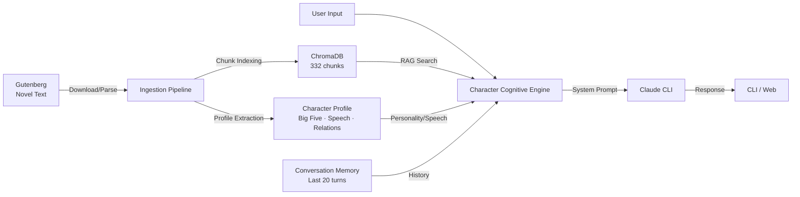
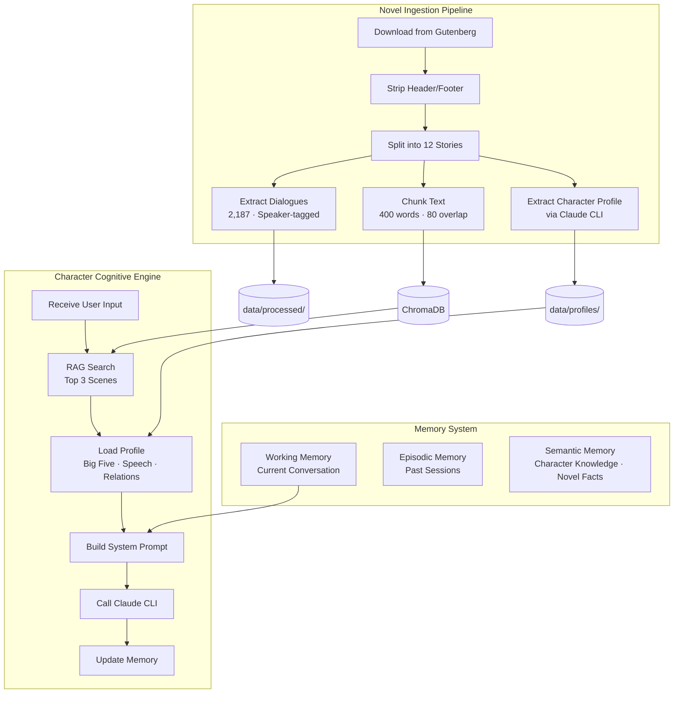
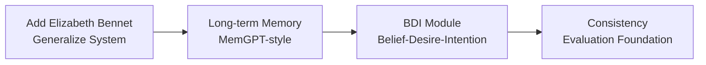

## Overview

A system where characters from famous novels become AI agents and converse with users. It maintains the character's personality, speech patterns, knowledge, and emotions based on the original novel text.

This is not simple role-play. The system automatically extracts the character's personality (Big Five), speech patterns, values, and relationships from the novel text, retrieves relevant scenes via RAG, and uses a cognitive engine to generate character-faithful responses.

The first character is **Sherlock Holmes** (The Adventures of Sherlock Holmes, Arthur Conan Doyle, 1892). The MVP was completed by extracting 2,187 dialogues from 12 short stories and indexing 332 vector chunks.

## Architecture



### Full System Detail



## Tech Stack

| Category | Tech | Why |
|----------|------|-----|
| Language | Python 3.11+ | Rich NLP ecosystem |
| LLM Backend | Claude Code CLI (`claude -p`) | No API key needed, local CLI |
| Vector DB | ChromaDB (cosine similarity) | Simple setup, local embeddings |
| Embeddings | all-MiniLM-L6-v2 (ONNX) | Lightweight, local |
| Text Source | Project Gutenberg | Public domain, free full text |
| Knowledge Graph | NetworkX + JSON | Lightweight, fast prototyping |
| CLI UI | Rich | Colorful terminal output |

## Pipeline

### 1. Ingestion -- Novel Text Collection & Parsing

Downloads the original text from Gutenberg and transforms it into structured data.

- **Download**: Fetch full text from Project Gutenberg via `requests`
- **Preprocessing**: Auto-strip Gutenberg header/footer, Unicode normalization
- **Story Splitting**: Auto-split 12 stories by Roman numeral + uppercase title patterns
- **Dialogue Extraction**: Unicode curly quote matching (`"..."`), speaker tagging (said/cried/asked + name patterns)
- **Vector Indexing**: 400-word chunks (80-word overlap) indexed in ChromaDB with cosine similarity

### 2. Character Profile Extraction

Uses Claude CLI to automatically extract character profiles from the novel text.

| Field | Extracted Content (Holmes example) |
|-------|-----------------------------------|
| Big Five | Openness 0.95 · Conscientiousness 0.82 · Extraversion 0.30 · Agreeableness 0.25 · Neuroticism 0.40 |
| Speech Patterns | "Pray take a seat" · "Quite so!" · "What do you make of that?" + 10 patterns |
| Values | Intellectual rigor, pursuit of truth, beauty of the bizarre, personal autonomy + 8 values |
| Relationships | Watson (affection behind condescension), Irene Adler (singular respect), Moriarty + 5 relations |
| Reasoning Style | Empirical observation → deductive inference, Socratic reveal |
| Emotional Tendencies | Emotional suppression, intellectual excitement, cocaine-ambition oscillation |
| Habits | Violin, cocaine, disguise, irregular hours, real-time reference lookup |

Each field is stored with **source text evidence** for traceability.

### 3. Character Cognitive Engine

Acts as the character's "brain." Each turn follows this process:

1. **RAG Search** -- Retrieve 3 relevant novel scenes from ChromaDB
2. **Conversation History** -- Load last 20 turns of context
3. **System Prompt Construction** -- Combine profile (Big Five, speech, values, relationships, habits, reasoning style) + RAG context + history into a single prompt
4. **Claude CLI Call** -- Generate character response from the composed prompt
5. **Memory Update** -- Add new dialogue to history

The system prompt includes 10 behavioral rules: character maintenance, reasoning demonstration, knowledge boundary enforcement, user language adaptation, etc.

### 4. Validation

Passed a 5-turn conversation test:

| Test | Input | Result |
|------|-------|--------|
| RAG Accuracy | "Orange seed letter" | Accurate recall of the "Five Orange Pips" case |
| Conversation Memory | "K.K.K." (continuation) | Maintained context from previous turn |
| Language Switching | Reasoning method Q in English | Character-consistent response in English |
| Emotional Expression | "Evaluate Watson" | Natural blend of praise, critique, and affection |
| Deep Question | "Do you ever feel lonely?" | Denial with loneliness between the lines |

## Novel Contributions

Three differentiators from existing character AI research (Character-LLM, RoleLLM, CoSER, etc.). Each can serve as an independent research contribution.

### 1. Chapter-wise Character Arc Tracking

Existing research treats characters as **static profiles**. Avatar models how characters evolve along the novel's timeline.

```python
agent.set_narrative_position(chapter=3)
# Converse with knowledge/emotions/relationships up to chapter 3 only
# → "Irene Adler? I have never heard that name." (before Story 1)
# → "The woman... the only one who ever outwitted me." (after Story 1)
```

- Generate character state snapshots per story
- Add temporal axis to the knowledge graph (story number)
- Limit RAG search scope by `narrative_position`
- Spoiler prevention logic

### 2. Second-order Theory of Mind

Holmes can reason "Watson would have thought this way." The character infers other characters' and the user's beliefs. An unexplored area in existing research.

- Model asymmetric knowledge/relationships between characters
- "What Holmes thinks Watson's perspective is" inference module
- "What Holmes infers about the user's knowledge level" adaptation module
- ToM accuracy benchmark design

### 3. Automatic Character Logic Extraction

Automatically extract behavioral rules from the novel text and convert them into executable code. An automation of the Codified Character Logic (2025) approach.

```python
# Auto-extracted behavioral rules for Holmes
holmes_rules = {
    "when_presented_with_mystery": "ask_for_details_systematically",
    "when_complimented": "deflect_with_dry_humor",
    "when_bored": "express_restlessness_or_seek_stimulation",
    "when_watson_is_wrong": "correct_gently_but_show_reasoning",
}
```

## Character Candidates

14 characters selected from the public domain:

| Novel | Character | Traits |
|-------|-----------|--------|
| **The Adventures of Sherlock Holmes** | Sherlock Holmes | Ultra-logical reasoning, dry wit (1st implementation) |
| **Pride and Prejudice** | Elizabeth Bennet | Sharp wit, social observation (2nd implementation) |
| **Dracula** | Count Dracula | Formal, threatening seductive speech |
| **Frankenstein** | The Creature | Philosophical monologue on identity |
| **Crime and Punishment** | Raskolnikov | Intense psychological interiority, moral anguish |
| **The Brothers Karamazov** | Ivan Karamazov | Literature's greatest philosophical voice |
| **Monte Cristo** | Edmond Dantès | Self-reinvention, multiple identities |
| **Don Quixote** | Don Quixote | Idealism vs. reality |
| **Alice in Wonderland** | Mad Hatter | Logic-bending, absurdist philosophy |
| **Huckleberry Finn** | Huck Finn | Distinctive vernacular, moral struggle |
| **Dr Jekyll & Mr Hyde** | Jekyll/Hyde | Dual personality switching |
| **Journey to the West** | Sun Wukong | Trickster, East Asian cultural icon |
| **The Tale of Genji** | Hikaru Genji | World's first novel, emotional complexity |
| **The Great Gatsby** | Jay Gatsby | Mysterious, ambitious, tragic (public domain 2021) |

## Roadmap

### Phase 1: MVP (Complete)

CLI-based agent for conversing with Sherlock Holmes.

- Novel text download and parsing (12 stories, 2,187 dialogues)
- Auto-extracted character profile (Big Five, 10 speech patterns, 8 values, 5 relationships)
- RAG-based conversation (ChromaDB, 332 chunks)
- CLI conversation interface (Rich UI)
- Basic conversation memory (in-session, last 20 turns)
- 5-turn conversation test passed (Korean/English)

### Phase 2: Deepening + Elizabeth Bennet



- **Elizabeth Bennet**: Parse Pride and Prejudice, extract profile, character selection UI. Remove Holmes hardcoding to generalize the system
- **Long-term Memory**: MemGPT-style 2-tier memory -- cross-session persistence, per-user relationship modeling ("Last time you mentioned...")
- **BDI Module**: Infer character's beliefs/desires/intentions each turn and include in prompt. Based on CharacterBox (2024)
- **Consistency Reinforcement**: Big Five consistency validation, knowledge boundary enforcement (RoleRAG), speech pattern verification (CharacterBench)

### Phase 3: Research-grade Features

- Chapter-wise character arc tracking -- temporal axis on knowledge graph
- Second-order Theory of Mind -- inter-character belief inference module
- Automatic character logic extraction -- novel text → if-then behavioral rules
- Reader progress awareness -- spoiler prevention
- Multi-axis evaluation framework -- CharacterBench + VER (NAACL 2025) + human evaluation

### Phase 4: Publication & Release

- Paper writing (ACL / EMNLP / NeurIPS Workshop)
- Open-source GitHub release
- Streamlit interactive demo
- Blog post & conference presentation

## Research Background

18 papers surveyed across 7 areas, informing the architecture design.

| Area | Key Papers | Project Application |
|------|-----------|---------------------|
| Character Dialogue | CoSER (ICML 2025), OpenCharacter (2025) | Character experience reconstruction pipeline from novel text |
| Literary RAG | RoleRAG (2025), ComoRAG (2025) | Character knowledge boundary graph-based retrieval |
| Long-term Memory | MemGPT (2023), A-Mem (2025), Memory OS (EMNLP 2025) | 2-tier memory (episodic + semantic) |
| Personality Modeling | InCharacter (2024), BIG5-CHAT (ACL 2025) | Big Five auto-extraction & consistency evaluation |
| Cognitive Architecture | CharacterBox (2024), CoALA (2023) | BDI model, modular cognitive architecture |
| Evaluation | CharacterBench (2024), VER (NAACL 2025) | Multi-axis: knowledge, personality, emotion, speech |
| Emerging | Codified Character Logic (2025), Neeko (EMNLP 2024) | Auto behavioral rule extraction, multi-character switching |

## Project Structure

```
_avatar/
├── src/
│   ├── main.py                 # CLI entry point
│   ├── ingestion/
│   │   ├── downloader.py       # Gutenberg downloader
│   │   ├── parser.py           # Story/dialogue parser
│   │   └── profile_extractor.py # Character profile extraction
│   ├── character/
│   │   ├── engine.py           # Cognitive engine (core)
│   │   ├── profile.py          # Profile loader
│   │   └── prompt_builder.py   # System prompt builder
│   ├── memory/
│   │   ├── conversation.py     # Conversation history
│   │   └── retriever.py        # ChromaDB RAG
│   └── evaluation/             # Evaluation framework (Phase 2+)
├── data/
│   ├── raw/                    # Original novel text
│   ├── processed/              # Parsed structured data
│   ├── profiles/               # Character profile JSON
│   └── vectordb/               # ChromaDB vector store
└── docs/                       # Research · Architecture · Roadmap
```
