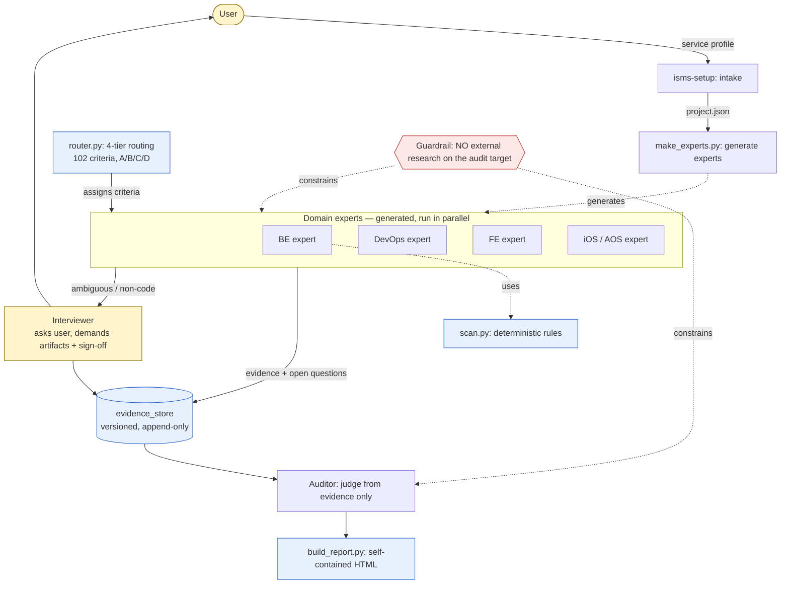

## Overview

ISMS-P Assist is a reference and case study on **how to engineer an LLM agent harness for a domain where wrong answers are expensive.**

The vehicle is ISMS-P (Korea's Information Security & Privacy Management System certification, 102 controls). Claude Code reviews code, infrastructure, and documents through a **domain experts → interviewer → auditor** multi-role pipeline, and outputs the results as a single self-contained HTML report with zero external dependencies.

The value is not the ISMS-P tool itself, but the **reusable harness patterns** behind it. Evidence router, deterministic/LLM split, agents-that-build-agents, information-boundary guardrail, abstention-first, and more — 10 patterns cataloged in `docs/PATTERNS.en.md`.

> ⚠️ This is an ISMS-P self-assessment / harness reference. It does not guarantee KISA's official certification results. For legal judgments, consult KISA's official guide and the source regulations.

## Architecture

Rather than "finish everything with code," each criterion is closed out with its **strongest evidence** — a 4-tier evidence router sits at the center.

Blue = deterministic (code/rules) · Yellow = human (interview) · Red = guardrail.

## 4-Tier Evidence Router

Each criterion is routed to its strongest source of truth (measured, `router.py`):

| Tier | Evidence Source | Criteria | Tools |
|------|-----------------|----------|-------|
| **A** Code/IaC | Static analysis | 35 | scan.py · Checkov · OPA |
| **B** Runtime | Read-only cloud API | 15 | Prowler (KISA-ISMS-P pack) · Steampipe |
| **C** Op records | Logs · registers · history upload | 9 | evidence.py |
| **D** Interview | Conversational Q + evidence + sign-off | 43 | isms-interview · interview.py |

→ **Automated (A+B) 49% · Interview (D) 42%.** The interviewer is half the product. Only half can be finished by code; the other half requires evidence from a human — and the key is to *not hide this*, but make it explicit in the architecture.

## Reusable Harness Patterns

What remains after you strip away ISMS-P — a catalog of high-stakes-domain agent design patterns (`docs/PATTERNS.en.md`):

| Pattern | Core | Implementation |
|---------|------|----------------|
| **Evidence router** | Route work to its strongest source of truth (deterministic / runtime / records / human) | `router.py` |
| **Deterministic/LLM split** | Rule-decidable cases in code, judgment-needed cases via LLM | `scan.py` |
| **Agents that build agents** | Intake profile → *generate* target-specific expert skills | `make_experts.py` |
| **Information-boundary guardrail** | No external research about the audit target (prevents contamination/hallucination) | `docs/AGENTS.md` |
| **Abstention-first** | When unsure, `needs-review`. Reliability via architecture, not prompting | `docs/RELIABILITY.md` |
| **Versioned evidence store** | Append-only, source and timestamp traceable | `store.py` |
| **Self-verifying harness** | Scan results carry confidence + false-positive reasoning → second pass removes false positives | `scan.py` |

## Verification (Hybrid)

Each criterion has a classified verification method (`knowledge/criteria.json`):

- **Code (17)**: Inspect source/config directly. e.g. password hashing, encryption, logging, access control, masking, dependency vulnerabilities
- **Mixed (39)**: Code + documentary evidence together
- **Document (46)**: Administrative criteria invisible to code → collected via evidence templates. e.g. executive involvement, training, risk assessment

The code scanner detects weak hashes, hardcoded keys, SQL injection, plaintext logging, vulnerable dependencies, etc. at `file:line`, attaching **confidence, surrounding context, and false-positive reasoning** to each candidate. These are *defect candidates* only — the final verdict comes from Claude/a reviewer reading the code.

## Claude Code Skills

| Skill | Description |
|-------|-------------|
| `isms-setup` | Service intake interview → generate target-specific expert skills |
| `isms-collect` | Orchestration: domain experts → evidence store → interview → audit |
| `isms-review` | Check compliance against 102 criteria (code inspection + documentary evidence) |
| `isms-audit` | Mock audit from a certified auditor's perspective → defect report |
| `isms-interview` | Conversationally collect evidence for code-invisible criteria (attachment + sign-off) |
| `isms-qa` | Answer questions on criteria, evidence, structure |

## Web Report

Review/audit results are output as a **single HTML file** (opens with no internet). It has two tabs:

- **Review/Audit Results** tab — verdicts, compliance scores, per-domain progress bars, status color badges, filter/search, print→PDF. Click a criterion code to jump to and highlight it in the *All Criteria* tab.
- **All Criteria** tab — the 102 criteria source (summary, checklist items, evidence, verification method) + data date and KISA official source links. You can cross-check the tool's encoded interpretation against the source in the other tab.

## Honest Limits

> The harness *skeleton* works (smoke CI). Golden-set regression, source grounding (RAG), and runtime checks are at the *design/partial* stage.

For a high-stakes-domain tool, the most important thing is to state precisely "what works and what doesn't yet." The non-inflated status is documented in `PATTERNS.en.md`.

## Tech Stack

| Category | Tech | Why |
|----------|------|-----|
| Language | Python 3 (zero deps) | Runs anywhere, no extra install |
| Agent Runtime | Claude Code (skills · subagents) | Multi-role orchestration |
| Static analysis | scan.py · Checkov · OPA | Deterministic code/IaC checks |
| Runtime checks | Prowler (KISA-ISMS-P pack) · Steampipe | Read-only cloud API |
| Report | Single HTML (zero external deps) | Opens anywhere, print→PDF |
| License | Apache-2.0 | Open source |

## Data Source

- KISA "Information Security & Privacy Management System Certification Criteria Guide" (2023.11 revision)
- Domain 1: 16 / Domain 2: 64 / Domain 3: 22 = **102 criteria**
- Source metadata & links: `meta.sources` in `knowledge/criteria.json`
