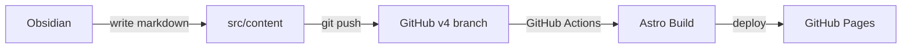
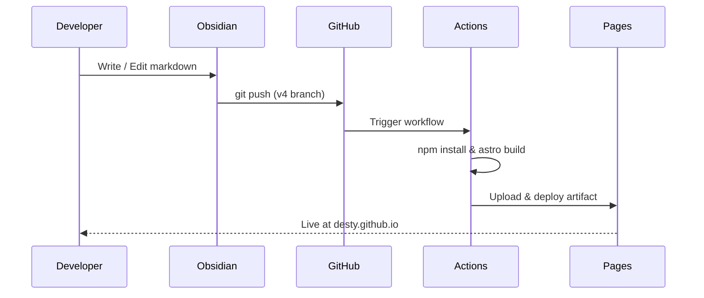

## Overview

A developer blog and portfolio site. The previous Jekyll blog was completely replaced with the Astro Sphere theme.

## Architecture



## Tech Stack

| Category | Tech |
|----------|------|
| Framework | Astro |
| Styling | Tailwind CSS |
| Language | TypeScript |
| UI | Solid.js (search) |
| Hosting | GitHub Pages |
| CI/CD | GitHub Actions |
| Diagram | Mermaid |
| Content | Markdown / MDX |

## Features

- **Dark/Light Mode** -- Toggle + system preference detection
- **Meteor Animations** -- Stars and meteor effects on the dark mode background
- **Code Highlighting** -- Multi-language support with copy button
- **Mermaid Diagrams** -- Flowcharts, sequence diagrams, class diagrams, and more
- **Full-text Search** -- Unified search across blog posts and projects
- **Auto Deploy** -- Build and deploy via GitHub Actions on push to the v4 branch
- **SEO** -- Automatic generation of sitemap, RSS, Open Graph, and robots.txt
- **Responsive** -- Mobile, tablet, and desktop

## Deploy Flow



## Project Structure

```
src/
├── components/     # Astro & Solid.js components
├── content/
│   ├── blog/       # Blog posts (markdown)
│   ├── projects/   # Projects (markdown)
│   ├── work/       # Work experience (markdown)
│   └── legal/      # Legal pages (markdown)
├── layouts/        # Page layouts
├── pages/          # Routing
├── styles/         # Global CSS
└── consts.ts       # Site configuration
```

## Setup History

1. Deleted the entire legacy Jekyll blog (2016~)
2. Tried Quartz 4 -- abandoned due to design limitations
3. Applied the Astro Sphere theme
4. Customized site metadata and social links
5. Set up the GitHub Actions deployment pipeline
6. Added Mermaid diagram support
