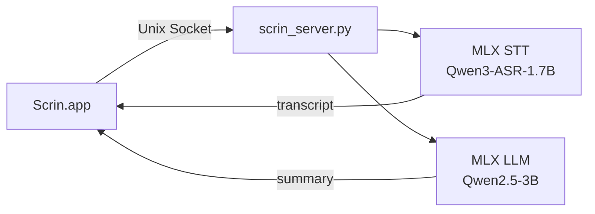
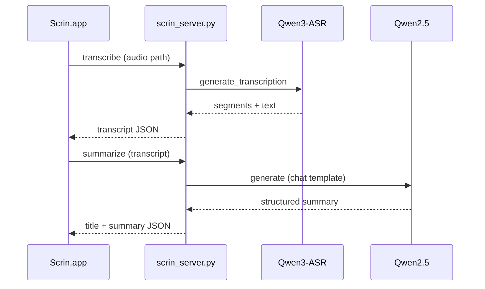

## Overview

A native macOS app for recording meetings, lectures, and media content, then organizing them with AI. Leveraging Apple Silicon's MLX framework, **all AI processing runs locally**. It provides STT and summarization while preserving privacy -- no cloud APIs needed.

## Architecture



## Tech Stack

| Category | Tech |
|----------|------|
| App | Swift 6 / SwiftUI |
| Platform | macOS 15+ |
| AI Runtime | MLX (Apple Silicon) |
| STT Model | Qwen3-ASR-1.7B-8bit |
| LLM Model | Qwen2.5-3B-Instruct-4bit |
| IPC | Unix Domain Socket |
| Editor | Tiptap (WKWebView) |
| Server | Python (mlx-audio, mlx-lm) |

## Features

- **Real-time Recording** -- Audio activity detection, pause/resume, floating recording prompt
- **On-device STT** -- Local transcription with the Qwen3-ASR model, automatic correction of Chinese misrecognition
- **AI Summarization** -- Custom summary templates for meetings, lectures, and media categories
- **Speaker Diarization** -- Automatic Speaker A/B classification using energy-based spectrum clustering
- **Ask AI** -- Q&A based on meeting content with conversation history
- **Rich Editor** -- Tiptap-based markdown editor with AI note rewriting
- **Template System** -- Customizable system prompts and user templates
- **Folder Management** -- Organize meeting notes by folder

## Server-App Communication



## Project Structure

```
scrin/
├── Scrin/                  # Swift Package
│   ├── Sources/
│   │   ├── App.swift       # App entry point
│   │   ├── Views/          # SwiftUI views
│   │   ├── Models/         # Data models & stores
│   │   ├── Audio/          # Audio capture
│   │   ├── STT/            # Server communication client
│   │   ├── Theme/          # UI theme
│   │   └── Tiptap/         # Rich editor bundle
│   └── Package.swift
└── scrin_server.py         # MLX AI server (STT + LLM)
```
