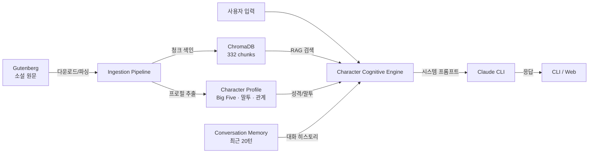
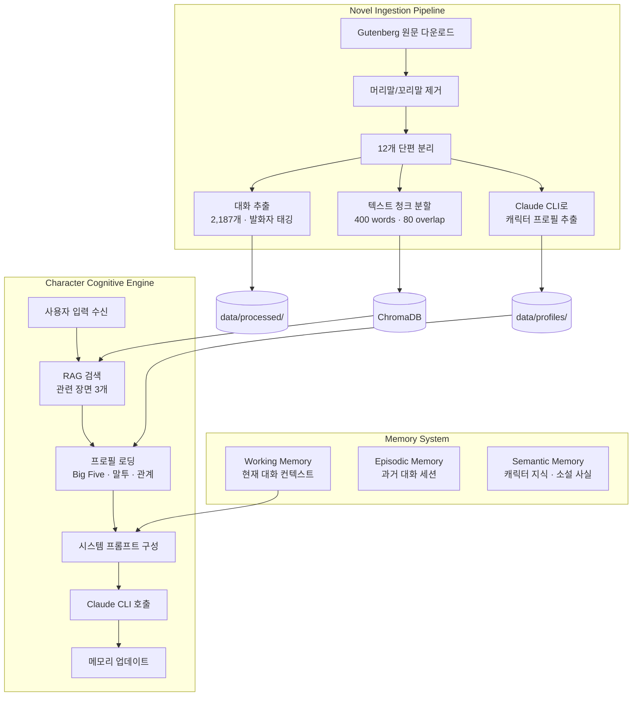
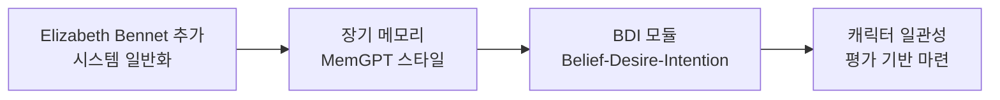

## Overview

유명 소설의 캐릭터가 에이전트가 되어 사용자와 대화하는 시스템. 소설 원문을 기반으로 캐릭터의 성격, 말투, 지식, 감정을 유지하면서 자연스러운 대화를 제공한다.

단순한 롤플레이가 아니라, 소설 텍스트에서 캐릭터의 성격(Big Five), 말투 패턴, 가치관, 관계를 자동 추출하고, RAG로 원문 장면을 검색하며, 인지 엔진이 캐릭터답게 응답을 생성한다.

1차 구현 캐릭터는 **셜록 홈즈** (The Adventures of Sherlock Holmes, Arthur Conan Doyle, 1892). 12개 단편에서 2,187개 대화를 추출하고, 332개 벡터 청크로 색인하여 MVP를 완성했다.

## Architecture



### 전체 시스템 상세



## Tech Stack

| Category | Tech | 이유 |
|----------|------|------|
| Language | Python 3.11+ | 에코시스템, NLP 라이브러리 풍부 |
| LLM Backend | Claude Code CLI (`claude -p`) | API 키 불필요, 로컬 CLI 활용 |
| Vector DB | ChromaDB (cosine similarity) | 설치 간단, 로컬 임베딩 저장 |
| Embeddings | all-MiniLM-L6-v2 (ONNX) | 경량, 로컬 임베딩 생성 |
| Text Source | Project Gutenberg | 퍼블릭 도메인, 전문 무료 접근 |
| Knowledge Graph | NetworkX + JSON | 경량, 빠른 프로토타이핑 |
| CLI UI | Rich | 컬러풀한 터미널 출력 |

## Pipeline

### 1. Ingestion — 소설 텍스트 수집 & 파싱

Gutenberg에서 원문을 다운로드하고 구조화된 데이터로 변환한다.

- **다운로드**: `requests`로 Project Gutenberg에서 전문 가져오기
- **전처리**: Gutenberg 머리말/꼬리말 자동 제거, 유니코드 정규화
- **스토리 분리**: 로마 숫자 + 대문자 제목 패턴으로 12개 단편 자동 분리
- **대화 추출**: 유니코드 curly quotes(`"..."`) 매칭, 발화자 태깅 (said/cried/asked + 이름 패턴)
- **벡터 색인**: 400-word 청크 (80-word 오버랩)로 분할 → ChromaDB에 코사인 유사도 기반 색인

### 2. Character Profile Extraction — 캐릭터 프로필 자동 추출

Claude CLI를 사용하여 소설 텍스트에서 캐릭터 프로필을 자동 추출한다.

| 항목 | 추출 내용 (홈즈 예시) |
|------|----------------------|
| Big Five | Openness 0.95 · Conscientiousness 0.82 · Extraversion 0.30 · Agreeableness 0.25 · Neuroticism 0.40 |
| 말투 패턴 | "Pray take a seat" · "Quite so!" · "What do you make of that?" 등 10개 |
| 가치관 | 지적 엄밀성, 진실 추구, 기이한 것에 대한 미학, 자율과 자유 등 8개 |
| 관계 | Watson (지적 경시 속 애정), Irene Adler (유일한 존경), Moriarty 등 5개 |
| 추론 스타일 | 경험적 관찰 → 연역적 추론, 소크라테스식 드러냄 |
| 감정 경향 | 감정 억제, 지적 흥분, 코카인과 야망 사이 진동 |
| 습관 | 바이올린, 코카인, 변장, 불규칙한 생활, 참고 자료 실시간 조회 |

각 항목에 **근거 텍스트**가 함께 저장되어 프로필의 출처를 추적할 수 있다.

### 3. Character Cognitive Engine — 캐릭터 인지 엔진

캐릭터의 "두뇌" 역할. 매 턴마다 다음 과정을 거쳐 응답을 생성한다.

1. **RAG 검색** — 사용자 입력과 관련된 소설 장면 3개를 ChromaDB에서 검색
2. **대화 히스토리** — 최근 20턴 컨텍스트 로딩
3. **시스템 프롬프트 구성** — 프로필(Big Five, 말투, 가치관, 관계, 습관, 추론 스타일) + RAG 컨텍스트 + 히스토리를 하나의 프롬프트로 조합
4. **Claude CLI 호출** — 조합된 프롬프트로 캐릭터 응답 생성
5. **메모리 업데이트** — 새 대화를 히스토리에 추가

시스템 프롬프트에는 10개의 행동 규칙이 포함된다: 캐릭터 유지, 추론 과정 시연, 지식 경계 준수, 사용자 언어 적응 등.

### 4. Validation — 검증 결과

5턴 대화 테스트를 통과했다:

| 테스트 | 입력 | 결과 |
|--------|------|------|
| RAG 정확성 | "오렌지 씨앗 편지" | "Five Orange Pips" 사건 정확 회상 |
| 대화 메모리 | "K.K.K." (이어서) | 이전 턴 맥락 유지, 연속 추론 |
| 언어 전환 | 영어로 추리법 질문 | 영어로 캐릭터 유지 응답 |
| 감정 표현 | 왓슨 평가 요청 | 칭찬+비판+애정이 자연스럽게 혼합 |
| 깊은 질문 | "외로움을 느끼나요?" | 부정하면서도 행간에 고독 드러남 |

## Novel Contributions — 논문급 차별화

기존 캐릭터 AI 연구(Character-LLM, RoleLLM, CoSER 등)와의 차별화 포인트 3가지. 각각이 독립적 연구 기여가 될 수 있다.

### 1. 챕터별 캐릭터 아크 추적

기존 연구는 캐릭터를 **정적 프로필**로 취급한다. Avatar는 소설 타임라인에 따라 캐릭터가 진화하는 것을 모델링한다.

```python
agent.set_narrative_position(chapter=3)
# 3장까지의 지식/감정/관계만으로 대화
# → "아이린 애들러? 나는 그런 이름을 들어본 적이 없소." (1장 이전)
# → "그 여자... 나를 이긴 유일한 사람이오." (1장 이후)
```

- 소설의 각 스토리별 캐릭터 상태 스냅샷 생성
- 지식 그래프에 시간축 추가 (스토리 번호)
- `narrative_position`에 따라 RAG 검색 범위 제한
- 스포일러 방지 로직

### 2. 2차 Theory of Mind

홈즈가 "왓슨이라면 이렇게 생각했겠지"라고 추론하는 능력. 캐릭터가 다른 캐릭터/사용자의 믿음을 추론한다. 기존 연구에서 다루지 않은 영역.

- 캐릭터 간 관계/지식 비대칭 모델링
- "홈즈가 생각하는 왓슨의 관점" 추론 모듈
- "홈즈가 추론하는 사용자의 지식 수준" 적응 모듈
- ToM 정확도 벤치마크 설계

### 3. 텍스트→캐릭터 로직 자동 추출

소설 텍스트에서 캐릭터의 행동 규칙을 자동으로 추출하여 실행 가능한 코드로 변환한다. Codified Character Logic (2025)의 접근법을 자동화한 것.

```python
# 소설에서 자동 추출된 홈즈의 행동 규칙
holmes_rules = {
    "when_presented_with_mystery": "ask_for_details_systematically",
    "when_complimented": "deflect_with_dry_humor",
    "when_bored": "express_restlessness_or_seek_stimulation",
    "when_watson_is_wrong": "correct_gently_but_show_reasoning",
}
```

## Character Candidates — 캐릭터 후보

퍼블릭 도메인에서 선정한 14개 캐릭터 후보:

| 소설 | 캐릭터 | 특징 |
|------|--------|------|
| **The Adventures of Sherlock Holmes** | Sherlock Holmes | 초논리적 추론, 건조한 위트 (1차 구현) |
| **Pride and Prejudice** | Elizabeth Bennet | 날카로운 위트, 사회 관찰 (2차 구현) |
| **Dracula** | Count Dracula | 격식체, 위협적 유혹 화법 |
| **Frankenstein** | The Creature | 정체성에 대한 철학적 독백 |
| **Crime and Punishment** | Raskolnikov | 강렬한 심리적 내면, 도덕적 고뇌 |
| **The Brothers Karamazov** | Ivan Karamazov | 문학 최고의 철학적 목소리 |
| **Monte Cristo** | Edmond Dantès | 자기 재창조, 다중 정체성 |
| **Don Quixote** | Don Quixote | 이상주의 vs 현실 |
| **Alice in Wonderland** | Mad Hatter | 논리 비틀기, 부조리 철학 |
| **Huckleberry Finn** | Huck Finn | 독특한 구어체, 도덕적 고뇌 |
| **Dr Jekyll & Mr Hyde** | Jekyll/Hyde | 이중 인격 전환 |
| **서유기** | 손오공 | 트릭스터, 동아시아 인지도 |
| **겐지 이야기** | 히카루 겐지 | 세계 최초 소설, 감정적 복잡성 |
| **The Great Gatsby** | Jay Gatsby | 신비롭고 비극적 (2021 퍼블릭 도메인) |

## Roadmap

### Phase 1: MVP (완료)

셜록 홈즈와 대화할 수 있는 CLI 기반 에이전트.

- 소설 텍스트 다운로드 및 파싱 (12 stories, 2,187 dialogues)
- 캐릭터 프로필 자동 추출 (Big Five, 말투 10개, 가치관 8개, 관계 5개)
- RAG 기반 대화 (ChromaDB 332 chunks)
- CLI 대화 인터페이스 (Rich UI)
- 기본 대화 메모리 (세션 내 최근 20턴)
- 5턴 대화 테스트 통과 (한국어/영어)

### Phase 2: 심화 + Elizabeth Bennet



- **Elizabeth Bennet 추가**: Pride and Prejudice 파싱, 프로필 추출, 캐릭터 선택 UI. Holmes 하드코딩 제거하여 시스템 일반화
- **장기 메모리**: MemGPT 스타일 2-tier 메모리 — 세션 간 대화 지속, 사용자별 관계 모델링 ("지난번에 당신이 말했던...")
- **BDI 모듈**: 매 턴마다 캐릭터의 믿음/욕구/의도를 추론하고 프롬프트에 포함. CharacterBox (2024) 참고
- **캐릭터 일관성 강화**: Big Five 일관성 검증, 지식 경계 강화 (RoleRAG), 말투 검증기 (CharacterBench)

### Phase 3: 논문급 기능

- 챕터별 캐릭터 아크 추적 — 지식 그래프에 시간축 추가
- 2차 Theory of Mind — 캐릭터 간 믿음 추론 모듈
- 자동 캐릭터 로직 추출 — 소설→if-then 행동 규칙 코드화
- 독자 진행도 인식 — 스포일러 방지
- 다축 평가 프레임워크 — CharacterBench + VER (NAACL 2025) + 인간 평가

### Phase 4: 발표 & 공개

- 논문 작성 (ACL / EMNLP / NeurIPS Workshop)
- 오픈소스 GitHub 공개
- Streamlit 인터랙티브 데모
- 블로그 포스트 & 학회 발표

## Research Background — 참고 논문

18개 논문을 7개 영역으로 조사하여 아키텍처에 반영했다.

| 영역 | 핵심 논문 | 프로젝트 적용 |
|------|----------|--------------|
| Character Dialogue | CoSER (ICML 2025), OpenCharacter (2025) | 소설 원문에서 캐릭터 경험 재구성 파이프라인 |
| Literary RAG | RoleRAG (2025), ComoRAG (2025) | 캐릭터 지식 경계 그래프 기반 검색 |
| Long-term Memory | MemGPT (2023), A-Mem (2025), Memory OS (EMNLP 2025) | 2-tier 메모리 (에피소드 + 의미) |
| Personality Modeling | InCharacter (2024), BIG5-CHAT (ACL 2025) | Big Five 자동 추출 & 일관성 평가 |
| Cognitive Architecture | CharacterBox (2024), CoALA (2023) | BDI 모델, 모듈식 인지 아키텍처 |
| Evaluation | CharacterBench (2024), VER (NAACL 2025) | 다축 평가: 지식, 성격, 감정, 말투 |
| Emerging | Codified Character Logic (2025), Neeko (EMNLP 2024) | 자동 행동 규칙 추출, 다중 캐릭터 전환 |

## Project Structure

```
_avatar/
├── src/
│   ├── main.py                 # CLI 진입점
│   ├── ingestion/
│   │   ├── downloader.py       # Gutenberg 다운로드
│   │   ├── parser.py           # 스토리/대화 파싱
│   │   └── profile_extractor.py # 캐릭터 프로필 추출
│   ├── character/
│   │   ├── engine.py           # 인지 엔진 (핵심)
│   │   ├── profile.py          # 프로필 로딩
│   │   └── prompt_builder.py   # 시스템 프롬프트 구성
│   ├── memory/
│   │   ├── conversation.py     # 대화 히스토리
│   │   └── retriever.py        # ChromaDB RAG
│   └── evaluation/             # 평가 프레임워크 (Phase 2+)
├── data/
│   ├── raw/                    # 원본 소설 텍스트
│   ├── processed/              # 파싱된 구조화 데이터
│   ├── profiles/               # 캐릭터 프로필 JSON
│   └── vectordb/               # ChromaDB 벡터 저장소
└── docs/                       # 연구 조사 · 아키텍처 · 로드맵
```
