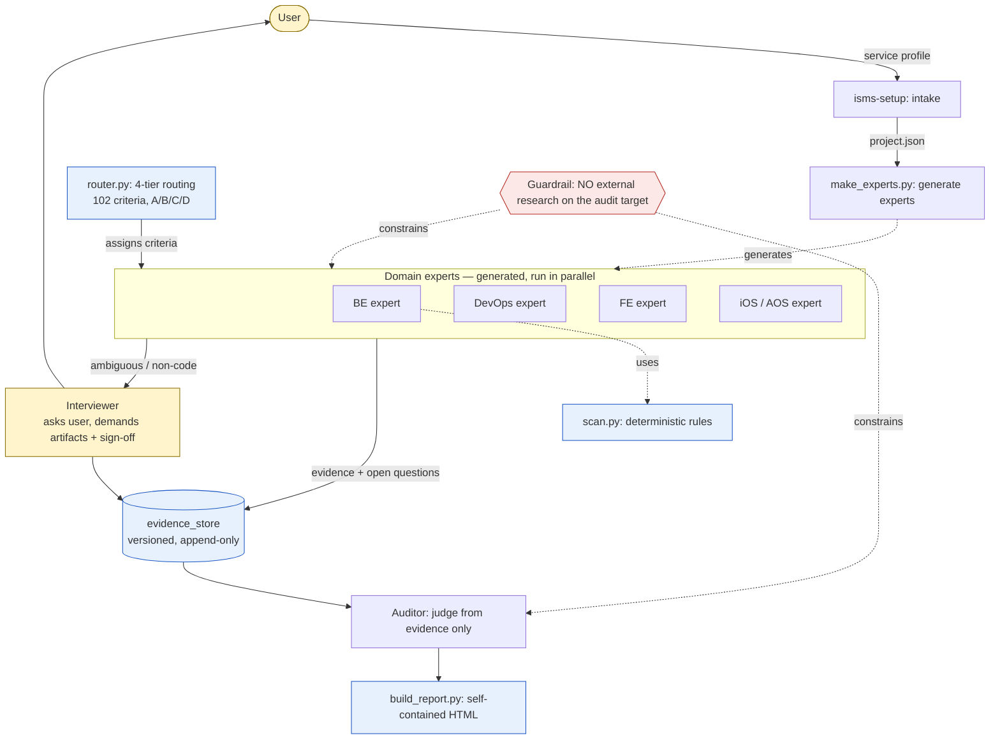

## Overview

ISMS-P Assist는 **LLM 에이전트 하네스를 "오답이 비싼" 도메인에서 어떻게 설계하는가**에 대한 레퍼런스이자 케이스 스터디다.

소재는 ISMS-P(정보보호·개인정보보호 관리체계 인증, 102개 기준). Claude Code가 코드·인프라·문서를 **분야별 전문가 → 인터뷰어 → 심사관** 멀티롤로 검토·심사하고, 결과를 외부 의존 0인 단일 HTML 리포트로 출력한다.

핵심은 ISMS-P 도구 자체가 아니라, 거기 쓰인 **재사용 가능한 하네스 패턴**이다. 증거 라우터, 결정론/LLM 분리, 에이전트를 만드는 에이전트, 정보 경계 가드레일, 기권 우선 등 10개 패턴을 `docs/PATTERNS.md`에 카탈로그로 정리했다.

> ⚠️ ISMS-P 자가점검·하네스 레퍼런스이며, KISA 공식 인증심사 결과를 보증하지 않는다. 법적 판단은 KISA 공식 안내서·법령 원문을 확인할 것.

## Architecture

"코드로 다 끝낸다"가 아니라, 각 기준을 **가장 강한 증거**로 마감하는 4-Tier 증거 라우터가 중심이다.

파란=결정론(코드/규칙) · 노랑=사람(인터뷰) · 빨강=가드레일.

## 4-Tier 증거 라우터

각 인증기준을 가장 강한 증거 출처로 라우팅한다 (실측, `router.py`):

| Tier | 증거 출처 | 기준 수 | 도구 |
|------|-----------|--------|------|
| **A** 코드/IaC | 정적분석 | 35 | scan.py · Checkov · OPA |
| **B** 런타임 | 읽기전용 클라우드 API | 15 | Prowler(KISA-ISMS-P 팩) · Steampipe |
| **C** 운영기록 | 로그·대장·이력 업로드 | 9 | evidence.py |
| **D** 인터뷰 | 대화형 질의+증적+서명 | 43 | isms-interview · interview.py |

→ **자동(A+B) 49% · 인터뷰(D) 42%.** 인터뷰어가 제품의 절반이다. 코드로 끝낼 수 있는 건 절반뿐이고, 나머지 절반은 사람에게 증적을 받아야 한다 — 이 사실을 숨기지 않고 아키텍처에 명시한 것이 핵심이다.

## 재사용 가능한 하네스 패턴

ISMS-P를 걷어내도 남는, 고위험 도메인 에이전트 설계 패턴 카탈로그 (`docs/PATTERNS.md`):

| 패턴 | 핵심 | 구현 |
|------|------|------|
| **증거 라우터** | 작업을 "가장 강한 진실 출처"로 라우팅 (결정론/런타임/기록/사람) | `router.py` |
| **결정론/LLM 분리** | 규칙으로 판정 가능한 건 코드로, 판단이 필요한 것만 LLM으로 | `scan.py` |
| **에이전트를 만드는 에이전트** | 인테이크 프로필 → 대상 전용 전문가 스킬 *생성* | `make_experts.py` |
| **정보 경계 가드레일** | 심사 대상에 대한 외부 조사 금지 (오염·환각 방지) | `docs/AGENTS.md` |
| **기권 우선** | 불확실하면 `확인필요`. 신뢰성은 프롬프트가 아니라 구조로 | `docs/RELIABILITY.md` |
| **버전드 증거 저장소** | append-only, 출처·시점 추적 가능 | `store.py` |
| **자기검증 하네스** | 스캔 결과에 신뢰도·오탐 사유 부여 → 2차 검증으로 오탐 제거 | `scan.py` |

## 검증 방식 (하이브리드)

각 인증기준은 검증방법이 분류돼 있다 (`knowledge/criteria.json`):

- **코드 (17개)**: 소스·설정을 직접 검사. 예) 비밀번호 해싱, 암호화, 로깅, 접근통제, 마스킹, 의존성 취약점
- **혼합 (39개)**: 코드 + 문서 증적을 함께 확인
- **문서 (46개)**: 코드로 볼 수 없는 관리적 기준 → 증적 템플릿으로 제출받아 검증. 예) 경영진 참여, 교육, 위험평가

코드 스캔은 취약 해시·하드코딩 키·SQL인젝션·평문 로깅·취약 의존성 등을 `file:line`으로 탐지하고, 각 후보에 **신뢰도·주변 컨텍스트·오탐 사유**를 부여한다. *결함 후보*일 뿐 최종 판정은 Claude/검토자가 코드를 읽고 내린다.

## Claude Code 스킬

| 스킬 | 설명 |
|------|------|
| `isms-setup` | 서비스 인테이크 인터뷰 → 대상 전용 전문가 스킬 생성 |
| `isms-collect` | 오케스트레이션: 분야 전문가 → 증거 저장소 → 인터뷰 → 심사 |
| `isms-review` | 102개 기준 대비 충족 여부 점검 (코드 검사 + 문서 증적) |
| `isms-audit` | 인증심사원 관점의 모의심사 → 결함보고서 |
| `isms-interview` | 코드에 없는 기준을 대화형으로 증적 수집 (첨부 + 서명) |
| `isms-qa` | 인증기준·증적·구조 등 질문 답변 |

## 웹 리포트

검토/심사 결과는 **단일 HTML 파일**(외부 인터넷 없이 열림)로 출력된다. 탭 2개로 구성된다:

- **검토·심사 결과** 탭 — 판정 결과, 충족 점수·영역별 진행 막대, 상태 색상 배지, 필터·검색, 인쇄→PDF. 기준 코드를 클릭하면 「전체 인증기준」 탭의 해당 항목으로 이동·하이라이트.
- **전체 인증기준** 탭 — 102개 기준 원본(요약·점검항목·증적·검증방법) + 데이터 기준일·KISA 공식 출처 링크. 도구가 인코딩한 해석을 다른 탭에서 직접 대조·검증할 수 있다.

## 정직한 한계

> 하네스 *골격*은 동작한다(스모크 CI). 정답셋 회귀·원문 그라운딩(RAG)·런타임 점검은 *설계/부분* 단계다.

고위험 도메인 도구에서 가장 중요한 건 "무엇이 동작하고 무엇이 아직 아닌가"를 정확히 말하는 것이다. 과장하지 않은 상태를 `PATTERNS.md`에 명시했다.

## Tech Stack

| Category | Tech | 이유 |
|----------|------|------|
| Language | Python 3 (의존성 0) | 어디서나 실행, 추가 설치 불필요 |
| Agent Runtime | Claude Code (스킬·서브에이전트) | 멀티롤 오케스트레이션 |
| 정적분석 | scan.py · Checkov · OPA | 코드/IaC 결정론적 점검 |
| 런타임 점검 | Prowler(KISA-ISMS-P 팩) · Steampipe | 읽기전용 클라우드 API |
| 리포트 | 단일 HTML (외부 의존 0) | 어디서나 열림, 인쇄→PDF |
| License | Apache-2.0 | 오픈소스 |

## 데이터 출처

- KISA 「정보보호 및 개인정보보호 관리체계 인증기준 안내서」(2023.11 개정)
- 영역 1: 16개 / 영역 2: 64개 / 영역 3: 22개 = **102개**
- 원본 메타·출처 링크: `knowledge/criteria.json`의 `meta.sources`
