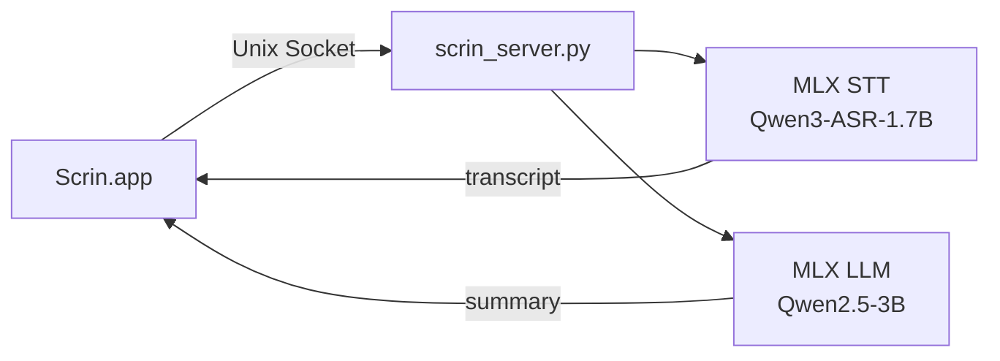
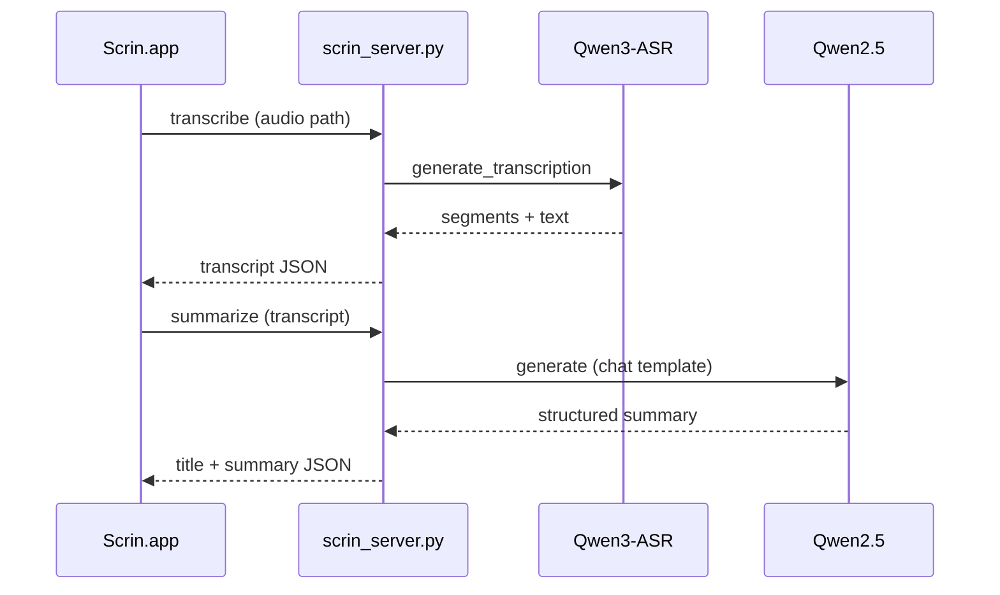

## Overview

회의, 강의, 미디어 콘텐츠를 녹음하고 AI로 정리하는 macOS 네이티브 앱. Apple Silicon의 MLX 프레임워크를 활용해 **모든 AI 처리를 로컬에서** 수행한다. 클라우드 API 없이 프라이버시를 지키면서 STT와 요약을 제공한다.

## Architecture



## Tech Stack

| Category | Tech |
|----------|------|
| App | Swift 6 / SwiftUI |
| Platform | macOS 15+ |
| AI Runtime | MLX (Apple Silicon) |
| STT Model | Qwen3-ASR-1.7B-8bit |
| LLM Model | Qwen2.5-3B-Instruct-4bit |
| IPC | Unix Domain Socket |
| Editor | Tiptap (WKWebView) |
| Server | Python (mlx-audio, mlx-lm) |

## Features

- **실시간 녹음** — 오디오 활동 감지, 일시정지/재개, 플로팅 녹음 프롬프트
- **온디바이스 STT** — Qwen3-ASR 모델로 로컬 전사, 중국어 오인식 자동 보정
- **AI 요약** — 회의 / 강의 / 미디어 카테고리별 맞춤 요약 템플릿
- **화자 분리** — 에너지 기반 스펙트럼 클러스터링으로 Speaker A/B 자동 분류
- **Ask AI** — 회의 내용 기반 Q&A, 대화 히스토리 유지
- **리치 에디터** — Tiptap 기반 마크다운 편집기, AI 노트 재작성
- **템플릿 시스템** — 시스템 프롬프트 & 사용자 템플릿 커스터마이징
- **폴더 관리** — 회의록 폴더별 정리

## Server–App Communication



## Project Structure

```
scrin/
├── Scrin/                  # Swift Package
│   ├── Sources/
│   │   ├── App.swift       # 앱 진입점
│   │   ├── Views/          # SwiftUI 뷰
│   │   ├── Models/         # 데이터 모델 & 스토어
│   │   ├── Audio/          # 오디오 캡처
│   │   ├── STT/            # 서버 통신 클라이언트
│   │   ├── Theme/          # UI 테마
│   │   └── Tiptap/         # 리치 에디터 번들
│   └── Package.swift
└── scrin_server.py         # MLX AI 서버 (STT + LLM)
```
