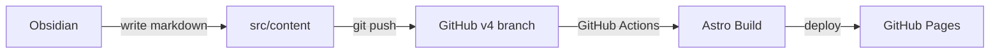
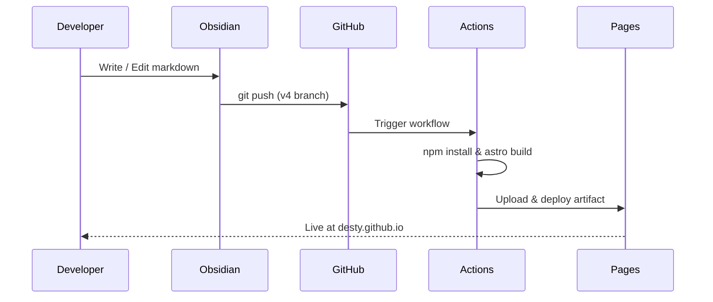

## Overview

개발자 블로그 & 포트폴리오 사이트. 기존 Jekyll 블로그를 Astro Sphere 테마로 완전 교체했다.

## Architecture



## Tech Stack

| Category | Tech |
|----------|------|
| Framework | Astro |
| Styling | Tailwind CSS |
| Language | TypeScript |
| UI | Solid.js (search) |
| Hosting | GitHub Pages |
| CI/CD | GitHub Actions |
| Diagram | Mermaid |
| Content | Markdown / MDX |

## Features

- **Dark/Light Mode** — 토글 + 시스템 설정 감지
- **유성 애니메이션** — 다크모드 배경에 별과 유성 효과
- **코드 하이라이팅** — 다중 언어 지원, 복사 버튼
- **Mermaid 다이어그램** — flowchart, sequence, class diagram 등
- **전문 검색** — 블로그/프로젝트 통합 검색
- **자동 배포** — v4 브랜치 push 시 GitHub Actions로 빌드 & 배포
- **SEO** — sitemap, RSS, Open Graph, robots.txt 자동 생성
- **반응형** — 모바일/태블릿/데스크톱

## Deploy Flow



## Project Structure

```
src/
├── components/     # Astro & Solid.js 컴포넌트
├── content/
│   ├── blog/       # 블로그 포스트 (markdown)
│   ├── projects/   # 프로젝트 (markdown)
│   ├── work/       # 경력 (markdown)
│   └── legal/      # 약관 (markdown)
├── layouts/        # 페이지 레이아웃
├── pages/          # 라우팅
├── styles/         # Global CSS
└── consts.ts       # 사이트 설정
```

## Setup History

1. 기존 Jekyll 블로그 (2016~) 전체 삭제
2. Quartz 4 시도 → 디자인 한계로 폐기
3. Astro Sphere 테마 적용
4. 사이트 메타데이터, 소셜 링크 커스텀
5. GitHub Actions 배포 파이프라인 구성
6. Mermaid 다이어그램 지원 추가
